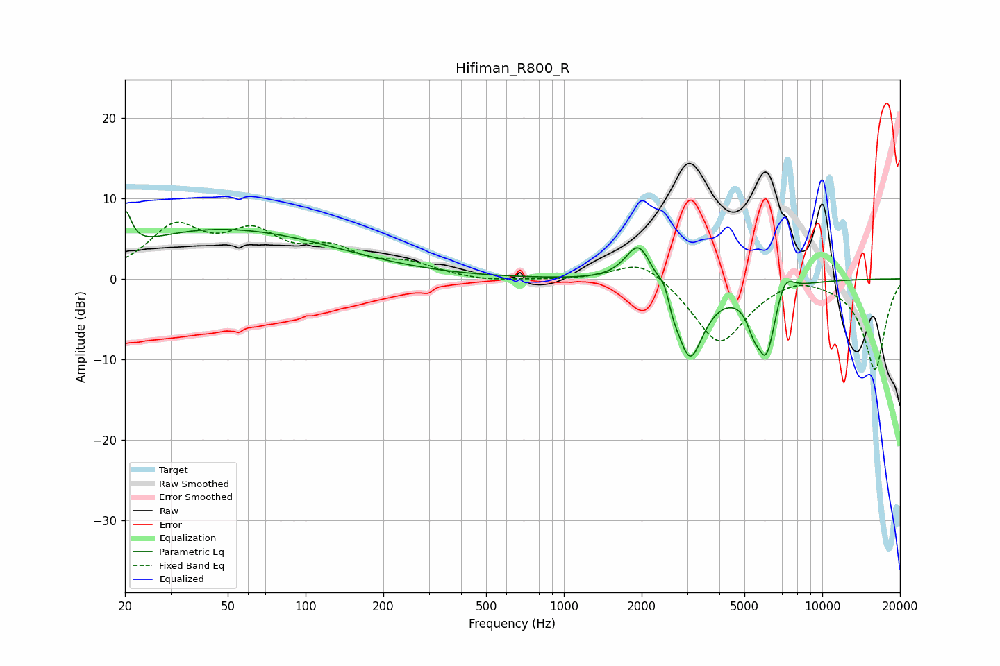

# Hifiman_R800_R
See [usage instructions](https://github.com/jaakkopasanen/AutoEq#usage) for more options and info.

### Parametric EQs
Apply preamp of -8.5 dB when using parametric equalizer.

|   # | Type    |   Fc (Hz) |    Q |   Gain (dB) |
|-----|---------|-----------|------|-------------|
|   1 | Peaking |        20 | 5.95 |         4.8 |
|   2 | Peaking |        32 | 0.67 |         1.3 |
|   3 | Peaking |        59 | 0.36 |         5.3 |
|   4 | Peaking |      1952 | 2.71 |         5.3 |
|   5 | Peaking |      2465 | 6    |         2.2 |
|   6 | Peaking |      2617 | 5.98 |        -1.5 |
|   7 | Peaking |      3075 | 2.55 |        -9.9 |
|   8 | Peaking |      5420 | 5.96 |        -1.9 |
|   9 | Peaking |      6074 | 3.34 |        -9.3 |
|  10 | Peaking |      7113 | 3.68 |         3.3 |

### Fixed Band EQs
When using fixed band (also called graphic) equalizer, apply preamp of **-7.1 dB** (if available) and set gains manually with these parameters.

|   # | Type    |   Fc (Hz) |    Q |   Gain (dB) |
|-----|---------|-----------|------|-------------|
|   1 | Peaking |        31 | 1.41 |         6   |
|   2 | Peaking |        62 | 1.41 |         4.8 |
|   3 | Peaking |       125 | 1.41 |         3   |
|   4 | Peaking |       250 | 1.41 |         1.6 |
|   5 | Peaking |       500 | 1.41 |        -0.4 |
|   6 | Peaking |      1000 | 1.41 |        -0.1 |
|   7 | Peaking |      2000 | 1.41 |         2.8 |
|   8 | Peaking |      4000 | 1.41 |        -8.2 |
|   9 | Peaking |      8000 | 1.41 |         1   |
|  10 | Peaking |     16000 | 1.41 |       -11.3 |

### Graphs

