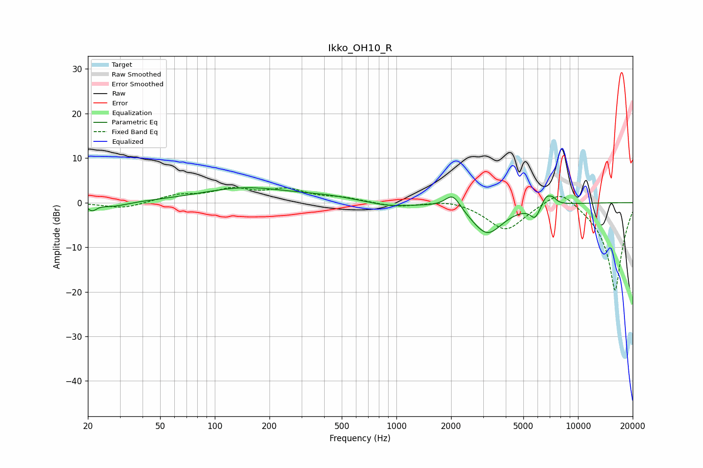

# Ikko_OH10_R
See [usage instructions](https://github.com/jaakkopasanen/AutoEq#usage) for more options and info.

### Parametric EQs
Apply preamp of -3.4 dB when using parametric equalizer.

|   # | Type    |   Fc (Hz) |    Q |   Gain (dB) |
|-----|---------|-----------|------|-------------|
|   1 | Peaking |        21 | 5.98 |        -1.5 |
|   2 | Peaking |        28 | 1.69 |        -1   |
|   3 | Peaking |       147 | 0.57 |         3.2 |
|   4 | Peaking |       413 | 0.91 |         0.9 |
|   5 | Peaking |       913 | 1.31 |        -0.9 |
|   6 | Peaking |      2046 | 3.29 |         3.5 |
|   7 | Peaking |      3161 | 1.58 |        -7   |
|   8 | Peaking |      5791 | 5.5  |        -2.6 |
|   9 | Peaking |      6688 | 6    |         2.1 |
|  10 | Peaking |      7244 | 6    |         1.3 |

### Fixed Band EQs
When using fixed band (also called graphic) equalizer, apply preamp of **-3.5 dB** (if available) and set gains manually with these parameters.

|   # | Type    |   Fc (Hz) |    Q |   Gain (dB) |
|-----|---------|-----------|------|-------------|
|   1 | Peaking |        31 | 1.41 |        -1.4 |
|   2 | Peaking |        62 | 1.41 |         1.6 |
|   3 | Peaking |       125 | 1.41 |         2.6 |
|   4 | Peaking |       250 | 1.41 |         2.6 |
|   5 | Peaking |       500 | 1.41 |         0.9 |
|   6 | Peaking |      1000 | 1.41 |        -1   |
|   7 | Peaking |      2000 | 1.41 |         0.9 |
|   8 | Peaking |      4000 | 1.41 |        -6.2 |
|   9 | Peaking |      8000 | 1.41 |         4.1 |
|  10 | Peaking |     16000 | 1.41 |       -20   |

### Graphs

