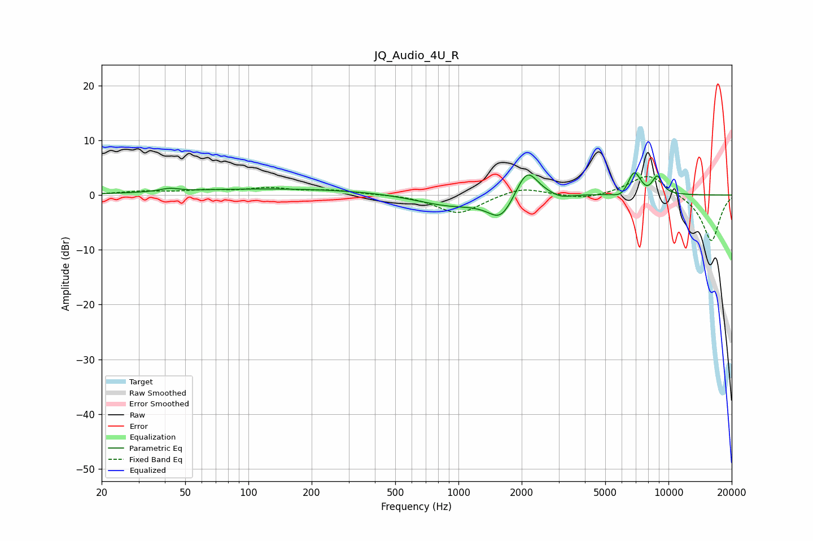

# JQ_Audio_4U_R
See [usage instructions](https://github.com/jaakkopasanen/AutoEq#usage) for more options and info.

### Parametric EQs
Apply preamp of -4.2 dB when using parametric equalizer.

|   # | Type    |   Fc (Hz) |    Q |   Gain (dB) |
|-----|---------|-----------|------|-------------|
|   1 | Peaking |        42 | 3.31 |         0.6 |
|   2 | Peaking |       145 | 0.27 |         1.2 |
|   3 | Peaking |       909 | 0.86 |        -2.1 |
|   4 | Peaking |      1593 | 2.32 |        -4.3 |
|   5 | Peaking |      2118 | 2.66 |         5.7 |
|   6 | Peaking |      3077 | 2.94 |        -0.7 |
|   7 | Peaking |      5982 | 3.76 |        -1.2 |
|   8 | Peaking |      6861 | 4.14 |         4.4 |
|   9 | Peaking |      7857 | 5.99 |        -0.5 |
|  10 | Peaking |      8849 | 5.27 |         3.2 |

### Fixed Band EQs
When using fixed band (also called graphic) equalizer, apply preamp of **-3.5 dB** (if available) and set gains manually with these parameters.

|   # | Type    |   Fc (Hz) |    Q |   Gain (dB) |
|-----|---------|-----------|------|-------------|
|   1 | Peaking |        31 | 1.41 |         0.6 |
|   2 | Peaking |        62 | 1.41 |         0.7 |
|   3 | Peaking |       125 | 1.41 |         1.1 |
|   4 | Peaking |       250 | 1.41 |         0.8 |
|   5 | Peaking |       500 | 1.41 |         0.2 |
|   6 | Peaking |      1000 | 1.41 |        -3.5 |
|   7 | Peaking |      2000 | 1.41 |         1.6 |
|   8 | Peaking |      4000 | 1.41 |        -0.9 |
|   9 | Peaking |      8000 | 1.41 |         4   |
|  10 | Peaking |     16000 | 1.41 |        -8.5 |

### Graphs

