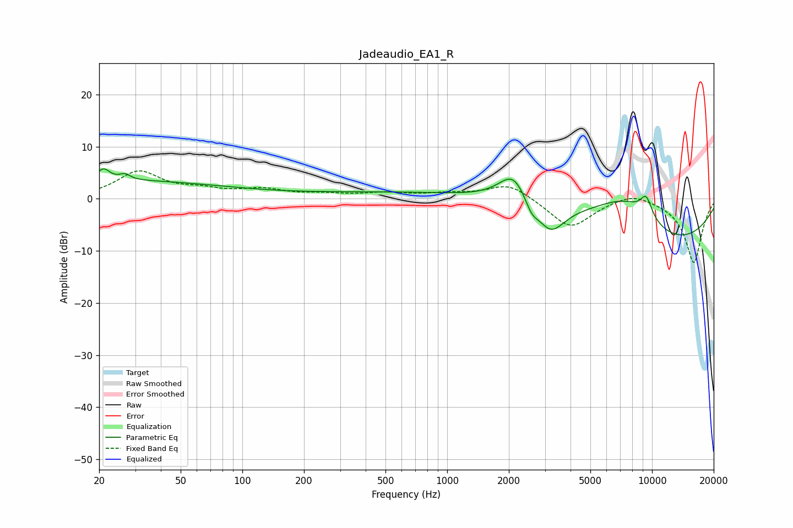

# Jadeaudio_EA1_R
See [usage instructions](https://github.com/jaakkopasanen/AutoEq#usage) for more options and info.

### Parametric EQs
Apply preamp of -5.8 dB when using parametric equalizer.

|   # | Type    |   Fc (Hz) |    Q |   Gain (dB) |
|-----|---------|-----------|------|-------------|
|   1 | Peaking |        20 | 0.2  |         3.5 |
|   2 | Peaking |        21 | 4.81 |         2.1 |
|   3 | Peaking |        27 | 5.64 |         1   |
|   4 | Peaking |      1043 | 0.18 |         1.4 |
|   5 | Peaking |      2104 | 1.98 |         5.8 |
|   6 | Peaking |      2579 | 4.52 |        -2.3 |
|   7 | Peaking |      3198 | 2.04 |        -5.6 |
|   8 | Peaking |      7515 | 0.69 |         9.9 |
|   9 | Peaking |      9364 | 4.3  |         3.9 |
|  10 | Peaking |     10000 | 0.32 |       -12.2 |

### Fixed Band EQs
When using fixed band (also called graphic) equalizer, apply preamp of **-5.4 dB** (if available) and set gains manually with these parameters.

|   # | Type    |   Fc (Hz) |    Q |   Gain (dB) |
|-----|---------|-----------|------|-------------|
|   1 | Peaking |        31 | 1.41 |         5   |
|   2 | Peaking |        62 | 1.41 |         1.3 |
|   3 | Peaking |       125 | 1.41 |         1.6 |
|   4 | Peaking |       250 | 1.41 |         0.7 |
|   5 | Peaking |       500 | 1.41 |         0.9 |
|   6 | Peaking |      1000 | 1.41 |         0.8 |
|   7 | Peaking |      2000 | 1.41 |         3   |
|   8 | Peaking |      4000 | 1.41 |        -5.7 |
|   9 | Peaking |      8000 | 1.41 |         1.6 |
|  10 | Peaking |     16000 | 1.41 |       -12.3 |

### Graphs

