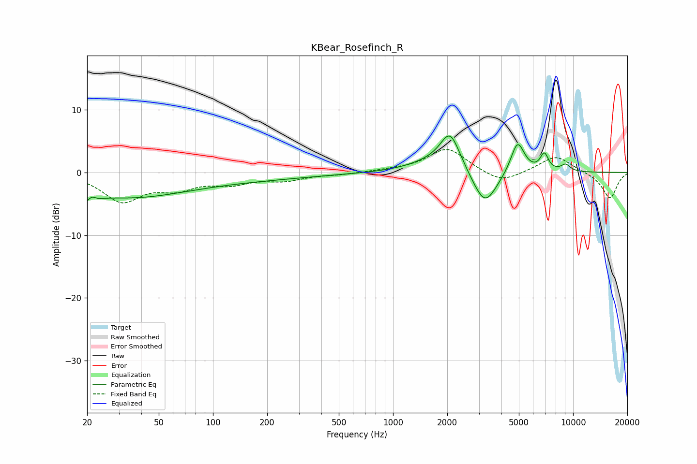

# KBear_Rosefinch_R
See [usage instructions](https://github.com/jaakkopasanen/AutoEq#usage) for more options and info.

### Parametric EQs
Apply preamp of -5.9 dB when using parametric equalizer.

|   # | Type    |   Fc (Hz) |    Q |   Gain (dB) |
|-----|---------|-----------|------|-------------|
|   1 | Peaking |        21 | 3.83 |        -3.9 |
|   2 | Peaking |        21 | 5.41 |         3   |
|   3 | Peaking |        33 | 0.45 |        -3.6 |
|   4 | Peaking |       138 | 0.35 |        -1   |
|   5 | Peaking |      1603 | 1.08 |         1.3 |
|   6 | Peaking |      2076 | 2.51 |         5.9 |
|   7 | Peaking |      3235 | 2.09 |        -5.8 |
|   8 | Peaking |      4916 | 3.64 |         5.2 |
|   9 | Peaking |      6921 | 5.95 |         2.7 |
|  10 | Peaking |      9084 | 4.71 |         1.1 |

### Fixed Band EQs
When using fixed band (also called graphic) equalizer, apply preamp of **-3.7 dB** (if available) and set gains manually with these parameters.

|   # | Type    |   Fc (Hz) |    Q |   Gain (dB) |
|-----|---------|-----------|------|-------------|
|   1 | Peaking |        31 | 1.41 |        -4.4 |
|   2 | Peaking |        62 | 1.41 |        -2.1 |
|   3 | Peaking |       125 | 1.41 |        -1.5 |
|   4 | Peaking |       250 | 1.41 |        -1.1 |
|   5 | Peaking |       500 | 1.41 |        -0.3 |
|   6 | Peaking |      1000 | 1.41 |         0.3 |
|   7 | Peaking |      2000 | 1.41 |         3.9 |
|   8 | Peaking |      4000 | 1.41 |        -1.9 |
|   9 | Peaking |      8000 | 1.41 |         2.7 |
|  10 | Peaking |     16000 | 1.41 |        -4.2 |

### Graphs

