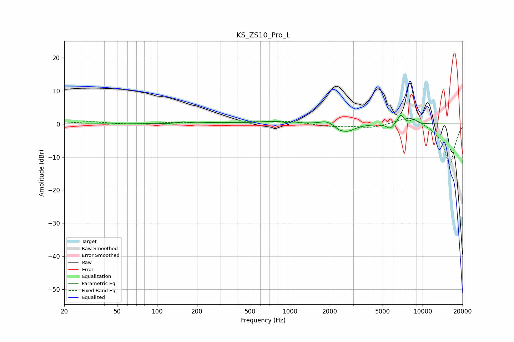

# KS_ZS10_Pro_L
See [usage instructions](https://github.com/jaakkopasanen/AutoEq#usage) for more options and info.

### Parametric EQs
Apply preamp of -2.7 dB when using parametric equalizer.

|   # | Type    |   Fc (Hz) |    Q |   Gain (dB) |
|-----|---------|-----------|------|-------------|
|   1 | Peaking |       158 | 3.57 |         0.4 |
|   2 | Peaking |       285 | 1.28 |         0.3 |
|   3 | Peaking |       813 | 1.12 |         0.9 |
|   4 | Peaking |       971 | 3.05 |        -0.4 |
|   5 | Peaking |      1888 | 3.09 |         1.1 |
|   6 | Peaking |      2348 | 4.97 |        -0.7 |
|   7 | Peaking |      2694 | 2.34 |        -2.3 |
|   8 | Peaking |      5682 | 5.29 |        -1.5 |
|   9 | Peaking |      6841 | 6    |         2.8 |
|  10 | Peaking |      8575 | 6    |         1.3 |

### Fixed Band EQs
When using fixed band (also called graphic) equalizer, apply preamp of **-1.8 dB** (if available) and set gains manually with these parameters.

|   # | Type    |   Fc (Hz) |    Q |   Gain (dB) |
|-----|---------|-----------|------|-------------|
|   1 | Peaking |        31 | 1.41 |         0.7 |
|   2 | Peaking |        62 | 1.41 |        -0.2 |
|   3 | Peaking |       125 | 1.41 |         0.4 |
|   4 | Peaking |       250 | 1.41 |         0.2 |
|   5 | Peaking |       500 | 1.41 |         0.5 |
|   6 | Peaking |      1000 | 1.41 |         0.8 |
|   7 | Peaking |      2000 | 1.41 |        -0.7 |
|   8 | Peaking |      4000 | 1.41 |        -1.1 |
|   9 | Peaking |      8000 | 1.41 |         2.6 |
|  10 | Peaking |     16000 | 1.41 |       -12.4 |

### Graphs

