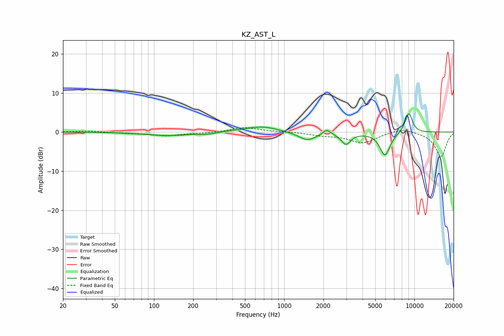

# KZ_AST_L
See [usage instructions](https://github.com/jaakkopasanen/AutoEq#usage) for more options and info.

### Parametric EQs
Apply preamp of -4.8 dB when using parametric equalizer.

|   # | Type    |   Fc (Hz) |    Q |   Gain (dB) |
|-----|---------|-----------|------|-------------|
|   1 | Peaking |       126 | 0.91 |        -0.9 |
|   2 | Peaking |       256 | 2.2  |        -0.5 |
|   3 | Peaking |       488 | 1.01 |         0.3 |
|   4 | Peaking |       696 | 1.26 |         1.3 |
|   5 | Peaking |      1509 | 2.07 |        -2.1 |
|   6 | Peaking |      2119 | 4.88 |         1.4 |
|   7 | Peaking |      2978 | 3.88 |        -2.9 |
|   8 | Peaking |      5941 | 3.46 |        -6   |
|   9 | Peaking |      8966 | 4.41 |         4.2 |
|  10 | Peaking |      9303 | 5.49 |         1.2 |

### Fixed Band EQs
When using fixed band (also called graphic) equalizer, apply preamp of **-1.2 dB** (if available) and set gains manually with these parameters.

|   # | Type    |   Fc (Hz) |    Q |   Gain (dB) |
|-----|---------|-----------|------|-------------|
|   1 | Peaking |        31 | 1.41 |         0.3 |
|   2 | Peaking |        62 | 1.41 |        -0.3 |
|   3 | Peaking |       125 | 1.41 |        -0.9 |
|   4 | Peaking |       250 | 1.41 |        -0.2 |
|   5 | Peaking |       500 | 1.41 |         1.2 |
|   6 | Peaking |      1000 | 1.41 |         0.1 |
|   7 | Peaking |      2000 | 1.41 |        -0.7 |
|   8 | Peaking |      4000 | 1.41 |        -2.7 |
|   9 | Peaking |      8000 | 1.41 |         1.1 |
|  10 | Peaking |     16000 | 1.41 |        -6.3 |

### Graphs

