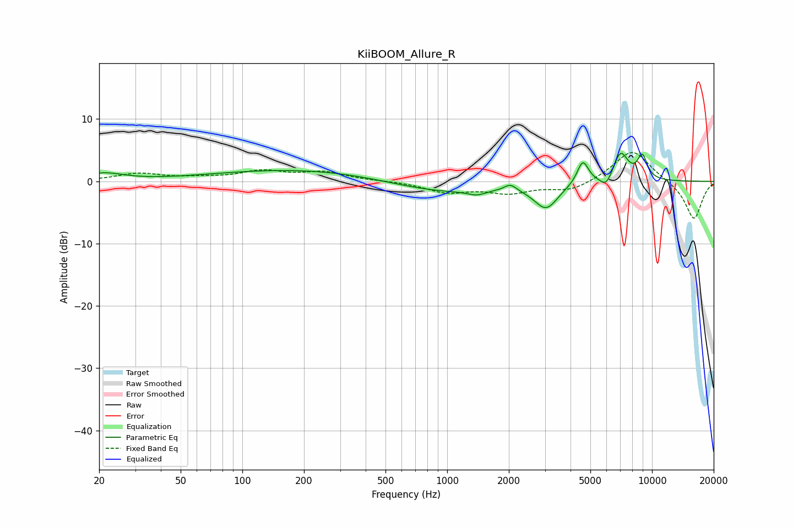

# KiiBOOM_Allure_R
See [usage instructions](https://github.com/jaakkopasanen/AutoEq#usage) for more options and info.

### Parametric EQs
Apply preamp of -4.6 dB when using parametric equalizer.

|   # | Type    |   Fc (Hz) |    Q |   Gain (dB) |
|-----|---------|-----------|------|-------------|
|   1 | Peaking |        21 | 1.55 |         1.2 |
|   2 | Peaking |       211 | 0.31 |         2   |
|   3 | Peaking |       918 | 0.5  |        -2.1 |
|   4 | Peaking |      1393 | 3.46 |        -0.7 |
|   5 | Peaking |      2034 | 4.69 |         1.1 |
|   6 | Peaking |      3043 | 2.42 |        -4   |
|   7 | Peaking |      4593 | 5.01 |         3.8 |
|   8 | Peaking |      5984 | 4.69 |        -1.9 |
|   9 | Peaking |      7015 | 3.57 |         4.7 |
|  10 | Peaking |      8968 | 5.18 |         3.7 |

### Fixed Band EQs
When using fixed band (also called graphic) equalizer, apply preamp of **-4.7 dB** (if available) and set gains manually with these parameters.

|   # | Type    |   Fc (Hz) |    Q |   Gain (dB) |
|-----|---------|-----------|------|-------------|
|   1 | Peaking |        31 | 1.41 |         1.2 |
|   2 | Peaking |        62 | 1.41 |         0.4 |
|   3 | Peaking |       125 | 1.41 |         1.5 |
|   4 | Peaking |       250 | 1.41 |         1.4 |
|   5 | Peaking |       500 | 1.41 |         0.1 |
|   6 | Peaking |      1000 | 1.41 |        -1.7 |
|   7 | Peaking |      2000 | 1.41 |        -1.7 |
|   8 | Peaking |      4000 | 1.41 |        -1.6 |
|   9 | Peaking |      8000 | 1.41 |         5.2 |
|  10 | Peaking |     16000 | 1.41 |        -6.2 |

### Graphs

