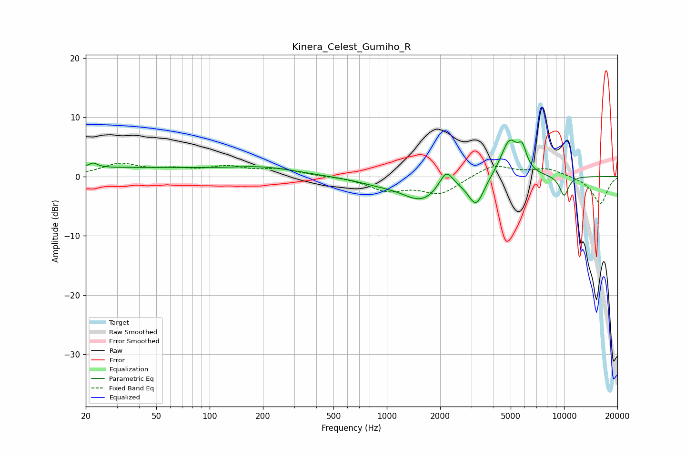

# Kinera_Celest_Gumiho_R
See [usage instructions](https://github.com/jaakkopasanen/AutoEq#usage) for more options and info.

### Parametric EQs
Apply preamp of -6.3 dB when using parametric equalizer.

|   # | Type    |   Fc (Hz) |    Q |   Gain (dB) |
|-----|---------|-----------|------|-------------|
|   1 | Peaking |        22 | 5.75 |         0.8 |
|   2 | Peaking |        31 | 0.19 |         1.5 |
|   3 | Peaking |       208 | 0.77 |         1.1 |
|   4 | Peaking |       902 | 1.01 |        -0.9 |
|   5 | Peaking |      1573 | 1.32 |        -3.7 |
|   6 | Peaking |      2162 | 3.75 |         3.1 |
|   7 | Peaking |      3192 | 3.1  |        -4.8 |
|   8 | Peaking |      4917 | 2.77 |         6.3 |
|   9 | Peaking |      5813 | 5.74 |         3.1 |
|  10 | Peaking |     10000 | 4.74 |        -3.4 |

### Fixed Band EQs
When using fixed band (also called graphic) equalizer, apply preamp of **-2.3 dB** (if available) and set gains manually with these parameters.

|   # | Type    |   Fc (Hz) |    Q |   Gain (dB) |
|-----|---------|-----------|------|-------------|
|   1 | Peaking |        31 | 1.41 |         2   |
|   2 | Peaking |        62 | 1.41 |         1   |
|   3 | Peaking |       125 | 1.41 |         1.4 |
|   4 | Peaking |       250 | 1.41 |         1.1 |
|   5 | Peaking |       500 | 1.41 |         0   |
|   6 | Peaking |      1000 | 1.41 |        -2.2 |
|   7 | Peaking |      2000 | 1.41 |        -2.8 |
|   8 | Peaking |      4000 | 1.41 |         2.1 |
|   9 | Peaking |      8000 | 1.41 |         1.3 |
|  10 | Peaking |     16000 | 1.41 |        -4.6 |

### Graphs

