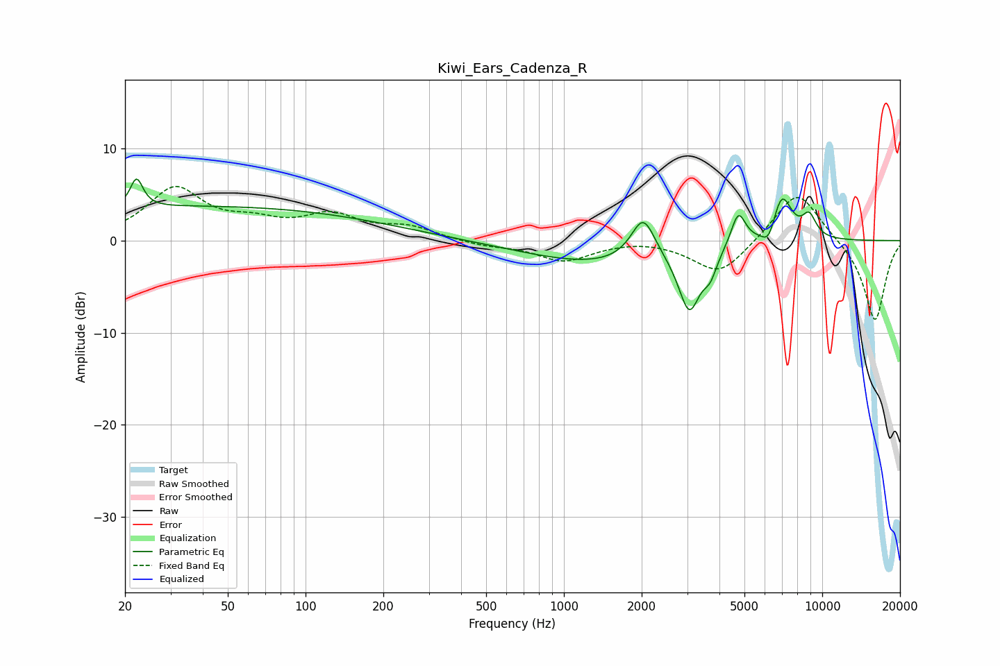

# Kiwi_Ears_Cadenza_R
See [usage instructions](https://github.com/jaakkopasanen/AutoEq#usage) for more options and info.

### Parametric EQs
Apply preamp of -6.8 dB when using parametric equalizer.

|   # | Type    |   Fc (Hz) |    Q |   Gain (dB) |
|-----|---------|-----------|------|-------------|
|   1 | Peaking |        22 | 5.9  |         3.2 |
|   2 | Peaking |        39 | 0.18 |         3.7 |
|   3 | Peaking |      1349 | 0.5  |        -2.5 |
|   4 | Peaking |      2028 | 3.02 |         4.7 |
|   5 | Peaking |      3059 | 3.33 |        -6.7 |
|   6 | Peaking |      3685 | 5.41 |        -2   |
|   7 | Peaking |      4733 | 4.89 |         3.7 |
|   8 | Peaking |      6222 | 4.96 |        -2.1 |
|   9 | Peaking |      6960 | 3.39 |         5.2 |
|  10 | Peaking |      8899 | 4.63 |         2.4 |

### Fixed Band EQs
When using fixed band (also called graphic) equalizer, apply preamp of **-6.0 dB** (if available) and set gains manually with these parameters.

|   # | Type    |   Fc (Hz) |    Q |   Gain (dB) |
|-----|---------|-----------|------|-------------|
|   1 | Peaking |        31 | 1.41 |         5.5 |
|   2 | Peaking |        62 | 1.41 |         1.5 |
|   3 | Peaking |       125 | 1.41 |         2.5 |
|   4 | Peaking |       250 | 1.41 |         1.3 |
|   5 | Peaking |       500 | 1.41 |        -0.5 |
|   6 | Peaking |      1000 | 1.41 |        -2.1 |
|   7 | Peaking |      2000 | 1.41 |         0.3 |
|   8 | Peaking |      4000 | 1.41 |        -3.8 |
|   9 | Peaking |      8000 | 1.41 |         5.7 |
|  10 | Peaking |     16000 | 1.41 |        -8.9 |

### Graphs

