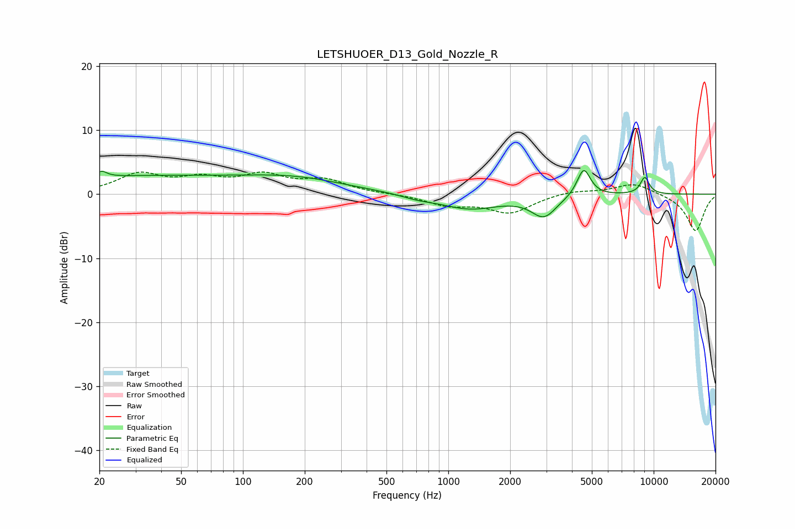

# LETSHUOER_D13_Gold_Nozzle_R
See [usage instructions](https://github.com/jaakkopasanen/AutoEq#usage) for more options and info.

### Parametric EQs
Apply preamp of -3.8 dB when using parametric equalizer.

|   # | Type    |   Fc (Hz) |    Q |   Gain (dB) |
|-----|---------|-----------|------|-------------|
|   1 | Peaking |        21 | 6    |         0.9 |
|   2 | Peaking |        29 | 0.27 |         2.7 |
|   3 | Peaking |       172 | 0.49 |         1.5 |
|   4 | Peaking |       186 | 0.68 |         0.7 |
|   5 | Peaking |       709 | 1.72 |        -0.5 |
|   6 | Peaking |      1272 | 0.99 |        -2.2 |
|   7 | Peaking |      2922 | 2.29 |        -3.3 |
|   8 | Peaking |      4565 | 4.25 |         4.4 |
|   9 | Peaking |      8924 | 5.96 |        -0.7 |
|  10 | Peaking |      9023 | 5.74 |         3.4 |

### Fixed Band EQs
When using fixed band (also called graphic) equalizer, apply preamp of **-3.6 dB** (if available) and set gains manually with these parameters.

|   # | Type    |   Fc (Hz) |    Q |   Gain (dB) |
|-----|---------|-----------|------|-------------|
|   1 | Peaking |        31 | 1.41 |         3   |
|   2 | Peaking |        62 | 1.41 |         2   |
|   3 | Peaking |       125 | 1.41 |         2.6 |
|   4 | Peaking |       250 | 1.41 |         2   |
|   5 | Peaking |       500 | 1.41 |         0   |
|   6 | Peaking |      1000 | 1.41 |        -1.6 |
|   7 | Peaking |      2000 | 1.41 |        -2.8 |
|   8 | Peaking |      4000 | 1.41 |         0.6 |
|   9 | Peaking |      8000 | 1.41 |         1.8 |
|  10 | Peaking |     16000 | 1.41 |        -5.8 |

### Graphs

