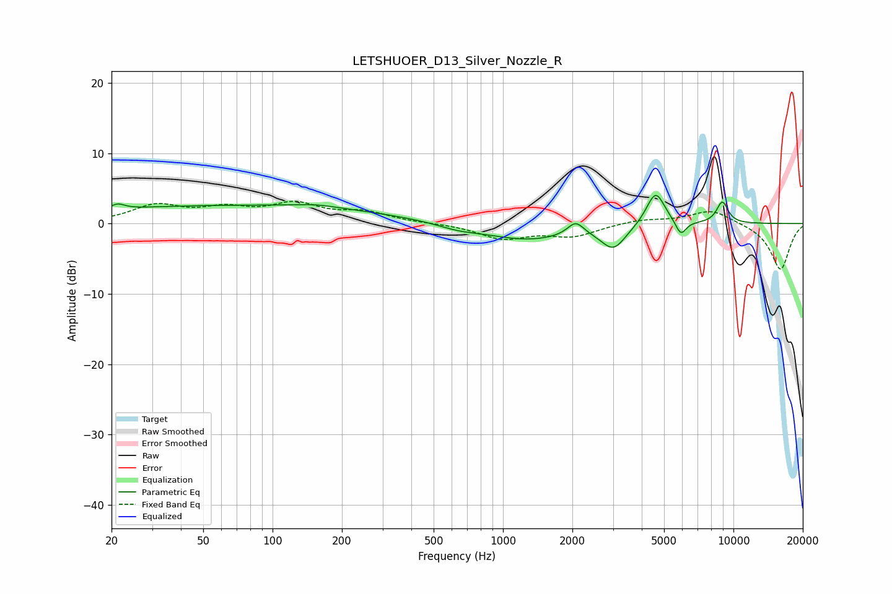

# LETSHUOER_D13_Silver_Nozzle_R
See [usage instructions](https://github.com/jaakkopasanen/AutoEq#usage) for more options and info.

### Parametric EQs
Apply preamp of -4.1 dB when using parametric equalizer.

|   # | Type    |   Fc (Hz) |    Q |   Gain (dB) |
|-----|---------|-----------|------|-------------|
|   1 | Peaking |        21 | 4.87 |         0.8 |
|   2 | Peaking |        67 | 0.18 |         2.6 |
|   3 | Peaking |       153 | 1.47 |         0.4 |
|   4 | Peaking |       636 | 1.57 |        -0.6 |
|   5 | Peaking |      1277 | 0.73 |        -2.3 |
|   6 | Peaking |      2067 | 4.03 |         1.9 |
|   7 | Peaking |      3016 | 2.63 |        -3.3 |
|   8 | Peaking |      4594 | 3.41 |         4.9 |
|   9 | Peaking |      5911 | 6    |        -2.1 |
|  10 | Peaking |      8950 | 5.04 |         3.1 |

### Fixed Band EQs
When using fixed band (also called graphic) equalizer, apply preamp of **-3.3 dB** (if available) and set gains manually with these parameters.

|   # | Type    |   Fc (Hz) |    Q |   Gain (dB) |
|-----|---------|-----------|------|-------------|
|   1 | Peaking |        31 | 1.41 |         2.4 |
|   2 | Peaking |        62 | 1.41 |         1.8 |
|   3 | Peaking |       125 | 1.41 |         2.5 |
|   4 | Peaking |       250 | 1.41 |         1.4 |
|   5 | Peaking |       500 | 1.41 |         0   |
|   6 | Peaking |      1000 | 1.41 |        -2.1 |
|   7 | Peaking |      2000 | 1.41 |        -1.7 |
|   8 | Peaking |      4000 | 1.41 |         0.6 |
|   9 | Peaking |      8000 | 1.41 |         2   |
|  10 | Peaking |     16000 | 1.41 |        -6.6 |

### Graphs

