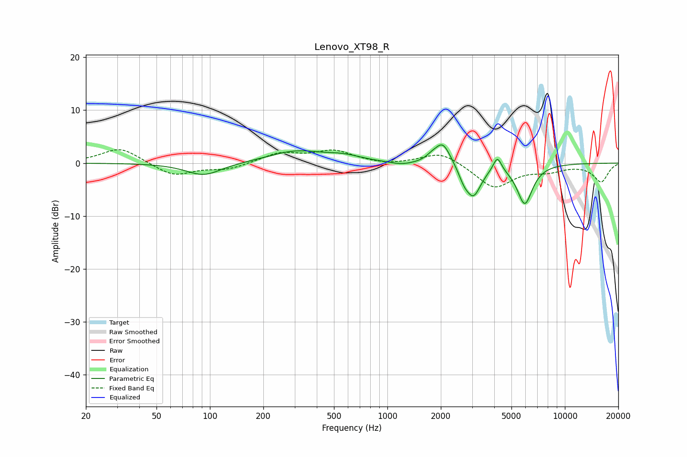

# Lenovo_XT98_R
See [usage instructions](https://github.com/jaakkopasanen/AutoEq#usage) for more options and info.

### Parametric EQs
Apply preamp of -3.5 dB when using parametric equalizer.

|   # | Type    |   Fc (Hz) |    Q |   Gain (dB) |
|-----|---------|-----------|------|-------------|
|   1 | Peaking |        92 | 1.43 |        -2.4 |
|   2 | Peaking |       305 | 0.93 |         2.2 |
|   3 | Peaking |       567 | 1.41 |         1   |
|   4 | Peaking |      1208 | 2.02 |        -0.6 |
|   5 | Peaking |      1775 | 4.55 |         0.6 |
|   6 | Peaking |      2050 | 3.18 |         4.2 |
|   7 | Peaking |      2696 | 4.8  |        -1.8 |
|   8 | Peaking |      3052 | 3.2  |        -5.9 |
|   9 | Peaking |      4166 | 6    |         2.8 |
|  10 | Peaking |      5944 | 3.16 |        -7.6 |

### Fixed Band EQs
When using fixed band (also called graphic) equalizer, apply preamp of **-2.6 dB** (if available) and set gains manually with these parameters.

|   # | Type    |   Fc (Hz) |    Q |   Gain (dB) |
|-----|---------|-----------|------|-------------|
|   1 | Peaking |        31 | 1.41 |         3   |
|   2 | Peaking |        62 | 1.41 |        -2.5 |
|   3 | Peaking |       125 | 1.41 |        -1.2 |
|   4 | Peaking |       250 | 1.41 |         1.8 |
|   5 | Peaking |       500 | 1.41 |         2.2 |
|   6 | Peaking |      1000 | 1.41 |        -0.4 |
|   7 | Peaking |      2000 | 1.41 |         2.3 |
|   8 | Peaking |      4000 | 1.41 |        -4.7 |
|   9 | Peaking |      8000 | 1.41 |        -1.2 |
|  10 | Peaking |     16000 | 1.41 |        -3.5 |

### Graphs

