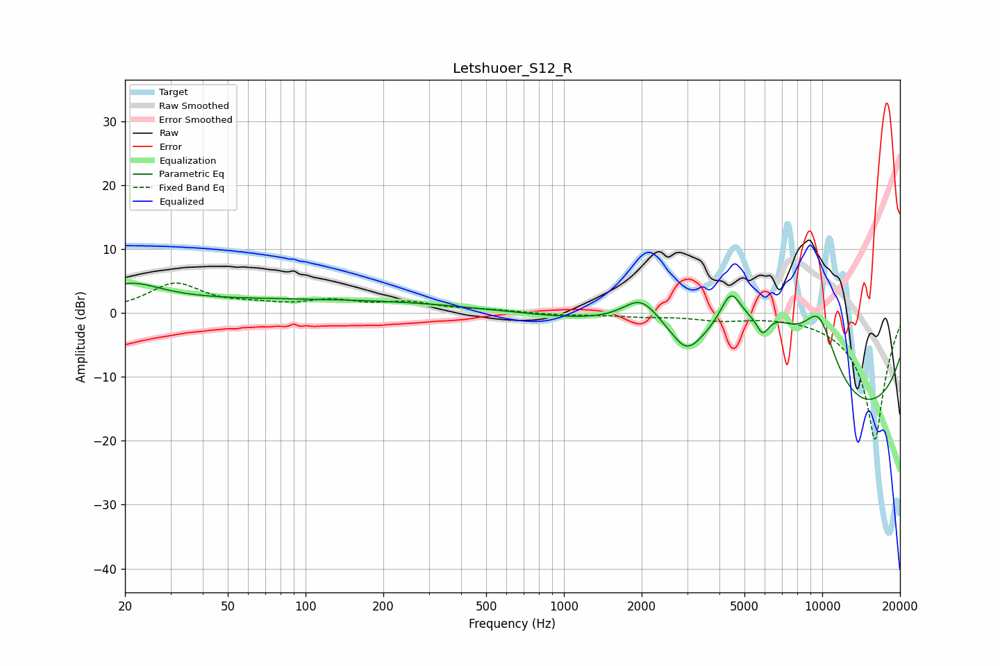

# Letshuoer_S12_R
See [usage instructions](https://github.com/jaakkopasanen/AutoEq#usage) for more options and info.

### Parametric EQs
Apply preamp of -4.7 dB when using parametric equalizer.

|   # | Type    |   Fc (Hz) |    Q |   Gain (dB) |
|-----|---------|-----------|------|-------------|
|   1 | Peaking |        21 | 1.19 |         3.3 |
|   2 | Peaking |        89 | 0.18 |         2.1 |
|   3 | Peaking |      1990 | 1.97 |         4.3 |
|   4 | Peaking |      2951 | 0.41 |         5.9 |
|   5 | Peaking |      2981 | 2.44 |        -4.1 |
|   6 | Peaking |      4426 | 3.18 |         6.1 |
|   7 | Peaking |      5890 | 5.62 |        -3   |
|   8 | Peaking |      6330 | 0.93 |         9.4 |
|   9 | Peaking |      9715 | 1.5  |        12.7 |
|  10 | Peaking |      9999 | 0.2  |       -20   |

### Fixed Band EQs
When using fixed band (also called graphic) equalizer, apply preamp of **-4.8 dB** (if available) and set gains manually with these parameters.

|   # | Type    |   Fc (Hz) |    Q |   Gain (dB) |
|-----|---------|-----------|------|-------------|
|   1 | Peaking |        31 | 1.41 |         4.4 |
|   2 | Peaking |        62 | 1.41 |         0.9 |
|   3 | Peaking |       125 | 1.41 |         1.6 |
|   4 | Peaking |       250 | 1.41 |         1.4 |
|   5 | Peaking |       500 | 1.41 |         0.4 |
|   6 | Peaking |      1000 | 1.41 |        -0.3 |
|   7 | Peaking |      2000 | 1.41 |        -0.4 |
|   8 | Peaking |      4000 | 1.41 |        -0.9 |
|   9 | Peaking |      8000 | 1.41 |         0.1 |
|  10 | Peaking |     16000 | 1.41 |       -20   |

### Graphs

