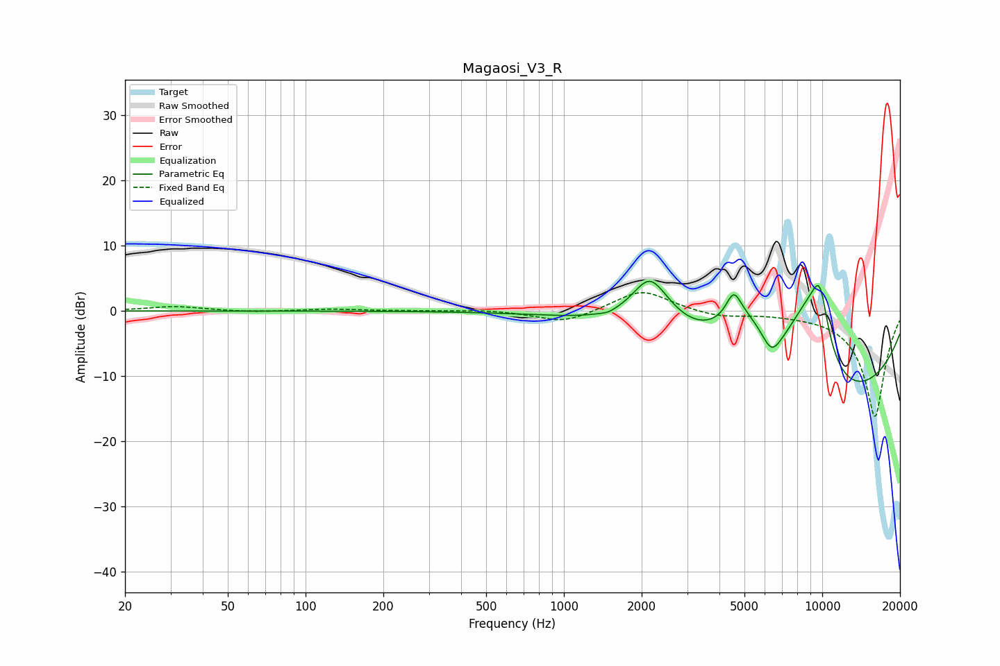

# Magaosi_V3_R
See [usage instructions](https://github.com/jaakkopasanen/AutoEq#usage) for more options and info.

### Parametric EQs
Apply preamp of -4.7 dB when using parametric equalizer.

|   # | Type    |   Fc (Hz) |    Q |   Gain (dB) |
|-----|---------|-----------|------|-------------|
|   1 | Peaking |      1490 | 4.95 |        -0.3 |
|   2 | Peaking |      2123 | 2.93 |         1.6 |
|   3 | Peaking |      2187 | 1.59 |         6.9 |
|   4 | Peaking |      4538 | 4.82 |         3.8 |
|   5 | Peaking |      5020 | 1.22 |         7.7 |
|   6 | Peaking |      6365 | 3.75 |        -3.2 |
|   7 | Peaking |      8363 | 1.65 |         6.9 |
|   8 | Peaking |      9556 | 2.25 |         8.5 |
|   9 | Peaking |      9849 | 4.66 |         4.1 |
|  10 | Peaking |     10000 | 0.26 |       -14.7 |

### Fixed Band EQs
When using fixed band (also called graphic) equalizer, apply preamp of **-2.9 dB** (if available) and set gains manually with these parameters.

|   # | Type    |   Fc (Hz) |    Q |   Gain (dB) |
|-----|---------|-----------|------|-------------|
|   1 | Peaking |        31 | 1.41 |         0.7 |
|   2 | Peaking |        62 | 1.41 |        -0.2 |
|   3 | Peaking |       125 | 1.41 |         0.3 |
|   4 | Peaking |       250 | 1.41 |         0   |
|   5 | Peaking |       500 | 1.41 |         0.2 |
|   6 | Peaking |      1000 | 1.41 |        -1.9 |
|   7 | Peaking |      2000 | 1.41 |         3.4 |
|   8 | Peaking |      4000 | 1.41 |        -0.9 |
|   9 | Peaking |      8000 | 1.41 |        -0.2 |
|  10 | Peaking |     16000 | 1.41 |       -16.3 |

### Graphs

