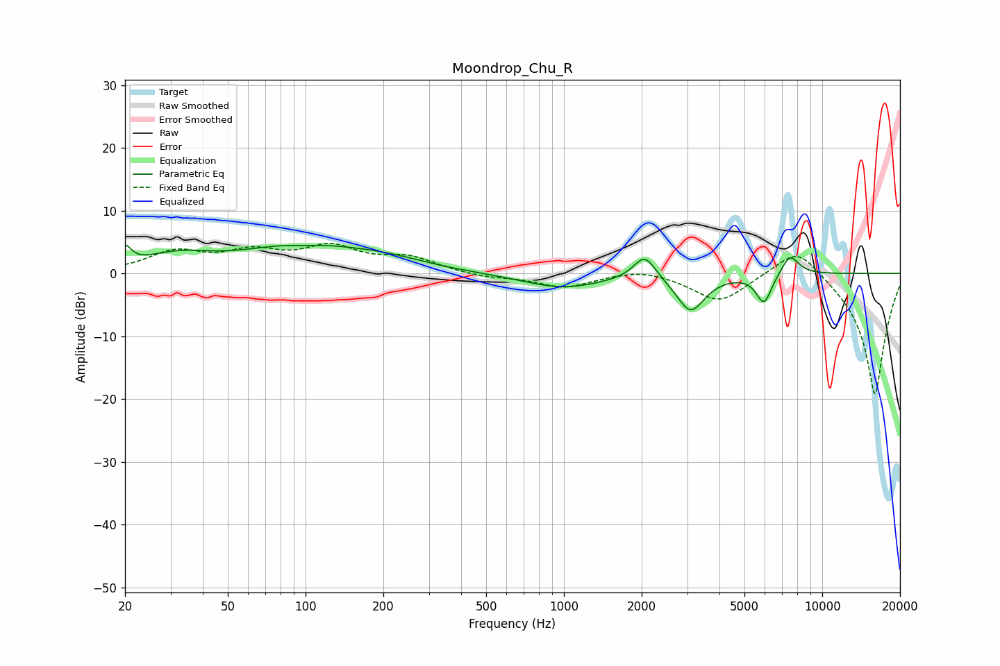

# Moondrop_Chu_R
See [usage instructions](https://github.com/jaakkopasanen/AutoEq#usage) for more options and info.

### Parametric EQs
Apply preamp of -4.6 dB when using parametric equalizer.

|   # | Type    |   Fc (Hz) |    Q |   Gain (dB) |
|-----|---------|-----------|------|-------------|
|   1 | Peaking |        20 | 5.96 |         2.8 |
|   2 | Peaking |        32 | 1.05 |         2.4 |
|   3 | Peaking |        98 | 0.63 |         4.5 |
|   4 | Peaking |       100 | 1.57 |        -0.7 |
|   5 | Peaking |       211 | 0.92 |         1.2 |
|   6 | Peaking |       985 | 0.91 |        -2.3 |
|   7 | Peaking |      2055 | 3.27 |         4   |
|   8 | Peaking |      3093 | 2.58 |        -5.9 |
|   9 | Peaking |      5951 | 4.59 |        -4.7 |
|  10 | Peaking |      7506 | 3.86 |         3.3 |

### Fixed Band EQs
When using fixed band (also called graphic) equalizer, apply preamp of **-4.9 dB** (if available) and set gains manually with these parameters.

|   # | Type    |   Fc (Hz) |    Q |   Gain (dB) |
|-----|---------|-----------|------|-------------|
|   1 | Peaking |        31 | 1.41 |         3.2 |
|   2 | Peaking |        62 | 1.41 |         2.9 |
|   3 | Peaking |       125 | 1.41 |         3.8 |
|   4 | Peaking |       250 | 1.41 |         2.3 |
|   5 | Peaking |       500 | 1.41 |        -0.6 |
|   6 | Peaking |      1000 | 1.41 |        -2.2 |
|   7 | Peaking |      2000 | 1.41 |         1   |
|   8 | Peaking |      4000 | 1.41 |        -4.6 |
|   9 | Peaking |      8000 | 1.41 |         5   |
|  10 | Peaking |     16000 | 1.41 |       -19.6 |

### Graphs

