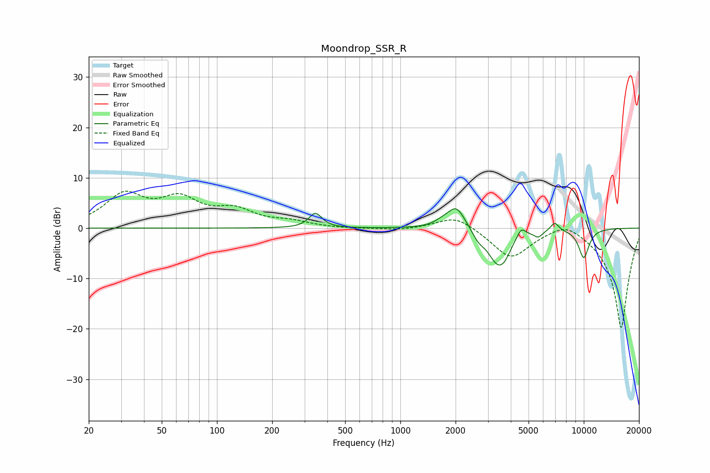

# Moondrop_SSR_R
See [usage instructions](https://github.com/jaakkopasanen/AutoEq#usage) for more options and info.

### Parametric EQs
Apply preamp of -3.9 dB when using parametric equalizer.

|   # | Type    |   Fc (Hz) |    Q |   Gain (dB) |
|-----|---------|-----------|------|-------------|
|   1 | Peaking |       344 | 4.09 |         2.9 |
|   2 | Peaking |      1683 | 3.23 |         0.7 |
|   3 | Peaking |      2020 | 2.83 |         4.6 |
|   4 | Peaking |      2657 | 4.56 |        -1.4 |
|   5 | Peaking |      3410 | 2.43 |        -7   |
|   6 | Peaking |      3729 | 5.32 |        -1.1 |
|   7 | Peaking |      4563 | 6    |         2   |
|   8 | Peaking |      5646 | 6    |        -1.2 |
|   9 | Peaking |      6939 | 6    |         1.7 |
|  10 | Peaking |     10000 | 4.25 |        -5.8 |

### Fixed Band EQs
When using fixed band (also called graphic) equalizer, apply preamp of **-7.4 dB** (if available) and set gains manually with these parameters.

|   # | Type    |   Fc (Hz) |    Q |   Gain (dB) |
|-----|---------|-----------|------|-------------|
|   1 | Peaking |        31 | 1.41 |         6.2 |
|   2 | Peaking |        62 | 1.41 |         5.1 |
|   3 | Peaking |       125 | 1.41 |         3.1 |
|   4 | Peaking |       250 | 1.41 |         1.1 |
|   5 | Peaking |       500 | 1.41 |        -0.1 |
|   6 | Peaking |      1000 | 1.41 |        -0.5 |
|   7 | Peaking |      2000 | 1.41 |         2.7 |
|   8 | Peaking |      4000 | 1.41 |        -5.9 |
|   9 | Peaking |      8000 | 1.41 |         2.3 |
|  10 | Peaking |     16000 | 1.41 |       -20   |

### Graphs

