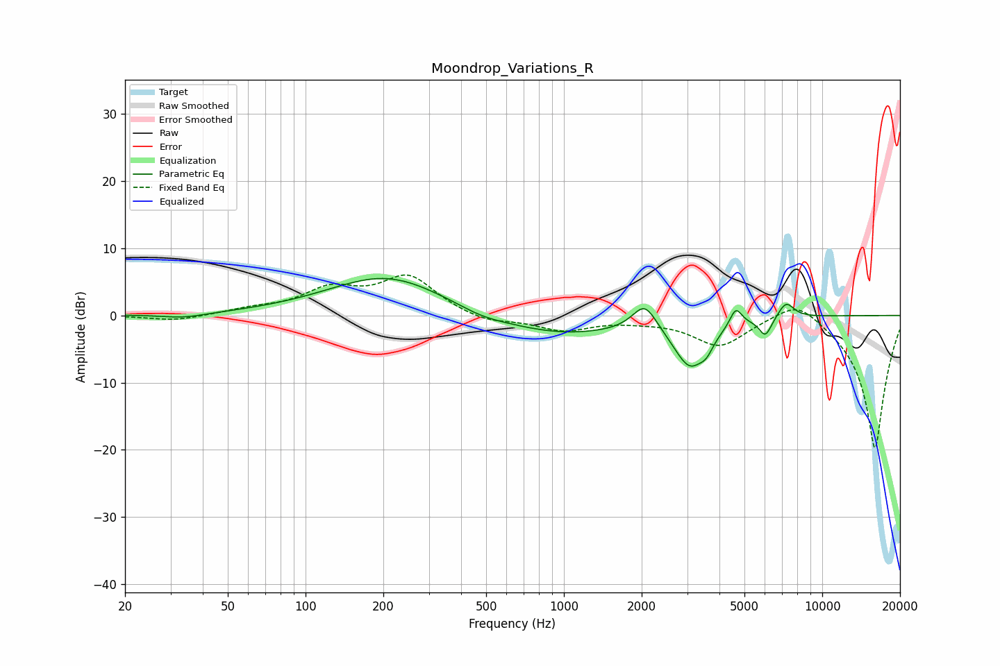

# Moondrop_Variations_R
See [usage instructions](https://github.com/jaakkopasanen/AutoEq#usage) for more options and info.

### Parametric EQs
Apply preamp of -5.6 dB when using parametric equalizer.

|   # | Type    |   Fc (Hz) |    Q |   Gain (dB) |
|-----|---------|-----------|------|-------------|
|   1 | Peaking |        34 | 1.65 |        -0.6 |
|   2 | Peaking |       207 | 0.61 |         6   |
|   3 | Peaking |       480 | 1.56 |        -0.8 |
|   4 | Peaking |       951 | 0.55 |        -3   |
|   5 | Peaking |      2055 | 2.98 |         4.1 |
|   6 | Peaking |      3073 | 2.17 |        -7   |
|   7 | Peaking |      3564 | 5.41 |        -1.5 |
|   8 | Peaking |      4629 | 6    |         2.7 |
|   9 | Peaking |      6026 | 5.72 |        -2.7 |
|  10 | Peaking |      7245 | 4.37 |         2.4 |

### Fixed Band EQs
When using fixed band (also called graphic) equalizer, apply preamp of **-6.1 dB** (if available) and set gains manually with these parameters.

|   # | Type    |   Fc (Hz) |    Q |   Gain (dB) |
|-----|---------|-----------|------|-------------|
|   1 | Peaking |        31 | 1.41 |        -0.9 |
|   2 | Peaking |        62 | 1.41 |         0.7 |
|   3 | Peaking |       125 | 1.41 |         3.5 |
|   4 | Peaking |       250 | 1.41 |         5.6 |
|   5 | Peaking |       500 | 1.41 |        -1.2 |
|   6 | Peaking |      1000 | 1.41 |        -2.1 |
|   7 | Peaking |      2000 | 1.41 |        -0.5 |
|   8 | Peaking |      4000 | 1.41 |        -4.4 |
|   9 | Peaking |      8000 | 1.41 |         3.3 |
|  10 | Peaking |     16000 | 1.41 |       -20   |

### Graphs

