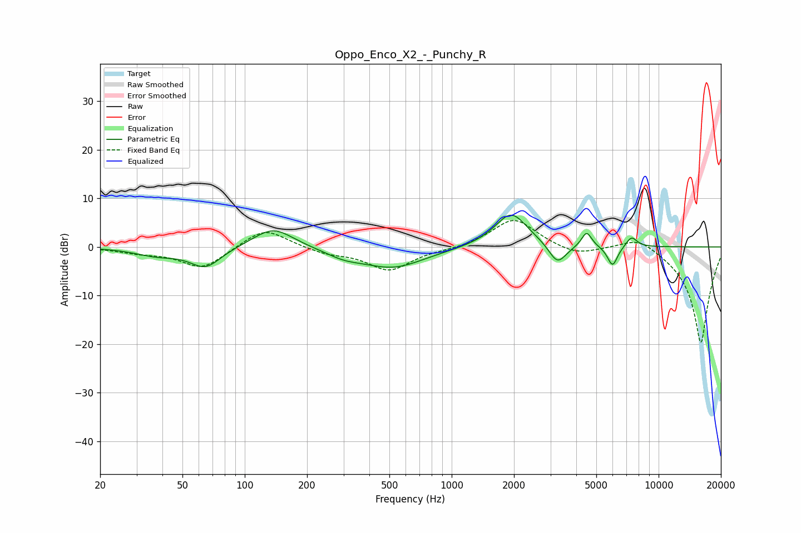

# Oppo_Enco_X2_-_Punchy_R
See [usage instructions](https://github.com/jaakkopasanen/AutoEq#usage) for more options and info.

### Parametric EQs
Apply preamp of -6.6 dB when using parametric equalizer.

|   # | Type    |   Fc (Hz) |    Q |   Gain (dB) |
|-----|---------|-----------|------|-------------|
|   1 | Peaking |        37 | 1.34 |        -1.6 |
|   2 | Peaking |        65 | 1.88 |        -4.1 |
|   3 | Peaking |       137 | 1.44 |         4.3 |
|   4 | Peaking |       301 | 1.61 |        -1.3 |
|   5 | Peaking |       521 | 0.91 |        -4.2 |
|   6 | Peaking |      1939 | 1.75 |         7.2 |
|   7 | Peaking |      3246 | 3.31 |        -4.3 |
|   8 | Peaking |      4489 | 5.67 |         3.2 |
|   9 | Peaking |      5990 | 5.57 |        -4.2 |
|  10 | Peaking |      7394 | 4.97 |         2.2 |

### Fixed Band EQs
When using fixed band (also called graphic) equalizer, apply preamp of **-5.5 dB** (if available) and set gains manually with these parameters.

|   # | Type    |   Fc (Hz) |    Q |   Gain (dB) |
|-----|---------|-----------|------|-------------|
|   1 | Peaking |        31 | 1.41 |        -1   |
|   2 | Peaking |        62 | 1.41 |        -4.5 |
|   3 | Peaking |       125 | 1.41 |         4.2 |
|   4 | Peaking |       250 | 1.41 |        -1.2 |
|   5 | Peaking |       500 | 1.41 |        -4.8 |
|   6 | Peaking |      1000 | 1.41 |        -0.4 |
|   7 | Peaking |      2000 | 1.41 |         6   |
|   8 | Peaking |      4000 | 1.41 |        -1.8 |
|   9 | Peaking |      8000 | 1.41 |         2.7 |
|  10 | Peaking |     16000 | 1.41 |       -20   |

### Graphs

