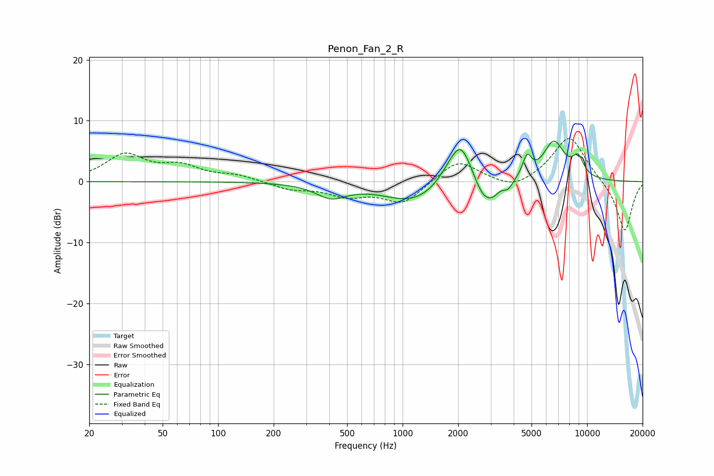

# Penon_Fan_2_R
See [usage instructions](https://github.com/jaakkopasanen/AutoEq#usage) for more options and info.

### Parametric EQs
Apply preamp of -6.8 dB when using parametric equalizer.

|   # | Type    |   Fc (Hz) |    Q |   Gain (dB) |
|-----|---------|-----------|------|-------------|
|   1 | Peaking |       410 | 1.71 |        -2.3 |
|   2 | Peaking |      1160 | 0.86 |        -3.5 |
|   3 | Peaking |      1843 | 1.94 |         1.9 |
|   4 | Peaking |      2080 | 2.24 |         6.5 |
|   5 | Peaking |      2757 | 2.48 |        -3.9 |
|   6 | Peaking |      3090 | 4.33 |        -1   |
|   7 | Peaking |      3738 | 5.55 |        -1.3 |
|   8 | Peaking |      4729 | 5.88 |         3.3 |
|   9 | Peaking |      6602 | 2.32 |         6.4 |
|  10 | Peaking |      8942 | 4.15 |         3   |

### Fixed Band EQs
When using fixed band (also called graphic) equalizer, apply preamp of **-7.2 dB** (if available) and set gains manually with these parameters.

|   # | Type    |   Fc (Hz) |    Q |   Gain (dB) |
|-----|---------|-----------|------|-------------|
|   1 | Peaking |        31 | 1.41 |         4.3 |
|   2 | Peaking |        62 | 1.41 |         2.2 |
|   3 | Peaking |       125 | 1.41 |         0.9 |
|   4 | Peaking |       250 | 1.41 |        -1.2 |
|   5 | Peaking |       500 | 1.41 |        -2.1 |
|   6 | Peaking |      1000 | 1.41 |        -3.6 |
|   7 | Peaking |      2000 | 1.41 |         3.7 |
|   8 | Peaking |      4000 | 1.41 |        -1.6 |
|   9 | Peaking |      8000 | 1.41 |         7.7 |
|  10 | Peaking |     16000 | 1.41 |        -8.4 |

### Graphs

