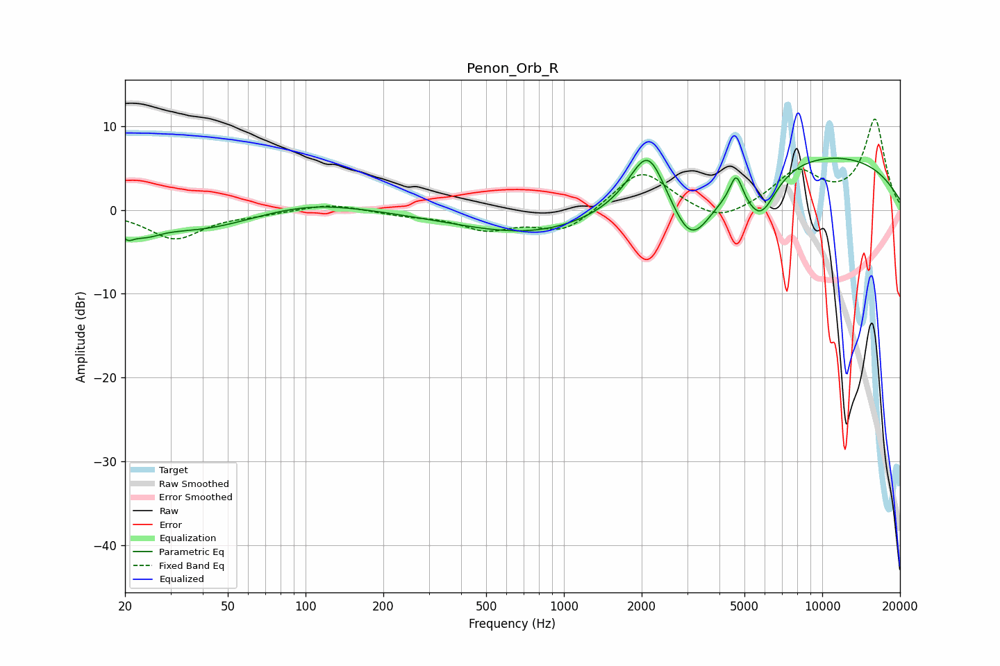

# Penon_Orb_R
See [usage instructions](https://github.com/jaakkopasanen/AutoEq#usage) for more options and info.

### Parametric EQs
Apply preamp of -6.3 dB when using parametric equalizer.

|   # | Type    |   Fc (Hz) |    Q |   Gain (dB) |
|-----|---------|-----------|------|-------------|
|   1 | Peaking |        20 | 5.35 |        -1.4 |
|   2 | Peaking |        24 | 2.32 |        -1.4 |
|   3 | Peaking |        39 | 0.66 |        -2.4 |
|   4 | Peaking |       103 | 0.69 |         1.2 |
|   5 | Peaking |       798 | 0.47 |        -3.2 |
|   6 | Peaking |      2116 | 1.96 |         7.4 |
|   7 | Peaking |      3105 | 1.59 |        -7.9 |
|   8 | Peaking |      4644 | 5.94 |         3.2 |
|   9 | Peaking |      5765 | 2.15 |        -5.6 |
|  10 | Peaking |      8823 | 0.24 |         6.9 |

### Fixed Band EQs
When using fixed band (also called graphic) equalizer, apply preamp of **-10.9 dB** (if available) and set gains manually with these parameters.

|   # | Type    |   Fc (Hz) |    Q |   Gain (dB) |
|-----|---------|-----------|------|-------------|
|   1 | Peaking |        31 | 1.41 |        -3.4 |
|   2 | Peaking |        62 | 1.41 |        -0.4 |
|   3 | Peaking |       125 | 1.41 |         0.8 |
|   4 | Peaking |       250 | 1.41 |        -0.5 |
|   5 | Peaking |       500 | 1.41 |        -2.2 |
|   6 | Peaking |      1000 | 1.41 |        -2.6 |
|   7 | Peaking |      2000 | 1.41 |         4.9 |
|   8 | Peaking |      4000 | 1.41 |        -1.9 |
|   9 | Peaking |      8000 | 1.41 |         4.3 |
|  10 | Peaking |     16000 | 1.41 |        10.7 |

### Graphs

