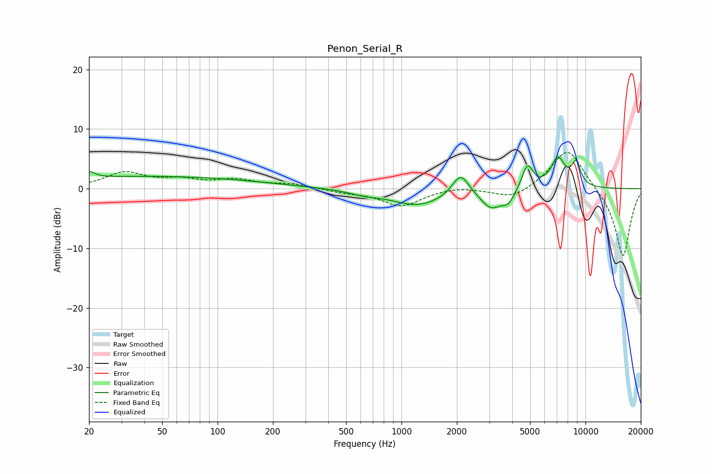

# Penon_Serial_R
See [usage instructions](https://github.com/jaakkopasanen/AutoEq#usage) for more options and info.

### Parametric EQs
Apply preamp of -5.4 dB when using parametric equalizer.

|   # | Type    |   Fc (Hz) |    Q |   Gain (dB) |
|-----|---------|-----------|------|-------------|
|   1 | Peaking |        20 | 4.87 |         1.1 |
|   2 | Peaking |        42 | 0.22 |         2.1 |
|   3 | Peaking |       627 | 1.71 |        -0.6 |
|   4 | Peaking |      1229 | 0.99 |        -2.8 |
|   5 | Peaking |      2096 | 3.14 |         3.7 |
|   6 | Peaking |      3063 | 2.51 |        -3   |
|   7 | Peaking |      3812 | 3.93 |        -2   |
|   8 | Peaking |      4839 | 4.53 |         4.2 |
|   9 | Peaking |      7083 | 3.49 |         4.9 |
|  10 | Peaking |      8901 | 5.13 |         3.8 |

### Fixed Band EQs
When using fixed band (also called graphic) equalizer, apply preamp of **-6.2 dB** (if available) and set gains manually with these parameters.

|   # | Type    |   Fc (Hz) |    Q |   Gain (dB) |
|-----|---------|-----------|------|-------------|
|   1 | Peaking |        31 | 1.41 |         2.6 |
|   2 | Peaking |        62 | 1.41 |         1.2 |
|   3 | Peaking |       125 | 1.41 |         1.3 |
|   4 | Peaking |       250 | 1.41 |         0.7 |
|   5 | Peaking |       500 | 1.41 |        -0.5 |
|   6 | Peaking |      1000 | 1.41 |        -2.9 |
|   7 | Peaking |      2000 | 1.41 |         0.5 |
|   8 | Peaking |      4000 | 1.41 |        -1.9 |
|   9 | Peaking |      8000 | 1.41 |         7.1 |
|  10 | Peaking |     16000 | 1.41 |       -11.6 |

### Graphs

