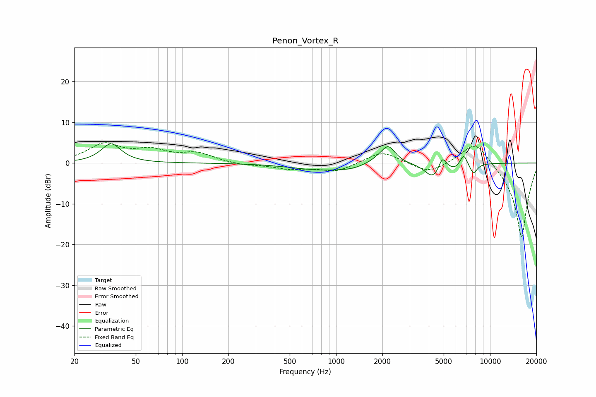

# Penon_Vortex_R
See [usage instructions](https://github.com/jaakkopasanen/AutoEq#usage) for more options and info.

### Parametric EQs
Apply preamp of -4.8 dB when using parametric equalizer.

|   # | Type    |   Fc (Hz) |    Q |   Gain (dB) |
|-----|---------|-----------|------|-------------|
|   1 | Peaking |        35 | 2.22 |         4.7 |
|   2 | Peaking |       816 | 0.74 |        -1.7 |
|   3 | Peaking |      1249 | 1.96 |        -0.5 |
|   4 | Peaking |      1879 | 2.48 |         0.8 |
|   5 | Peaking |      2183 | 3.08 |         4.2 |
|   6 | Peaking |      4248 | 2.8  |        -3.6 |
|   7 | Peaking |      4899 | 6    |         3   |
|   8 | Peaking |      5893 | 3.64 |        -1.1 |
|   9 | Peaking |      6744 | 6    |         2.8 |
|  10 | Peaking |      7798 | 5.4  |        -2.6 |

### Fixed Band EQs
When using fixed band (also called graphic) equalizer, apply preamp of **-5.1 dB** (if available) and set gains manually with these parameters.

|   # | Type    |   Fc (Hz) |    Q |   Gain (dB) |
|-----|---------|-----------|------|-------------|
|   1 | Peaking |        31 | 1.41 |         4.4 |
|   2 | Peaking |        62 | 1.41 |         2.6 |
|   3 | Peaking |       125 | 1.41 |         2.2 |
|   4 | Peaking |       250 | 1.41 |        -0.6 |
|   5 | Peaking |       500 | 1.41 |        -1.3 |
|   6 | Peaking |      1000 | 1.41 |        -2.1 |
|   7 | Peaking |      2000 | 1.41 |         3   |
|   8 | Peaking |      4000 | 1.41 |        -2.6 |
|   9 | Peaking |      8000 | 1.41 |         6   |
|  10 | Peaking |     16000 | 1.41 |       -18.5 |

### Graphs

