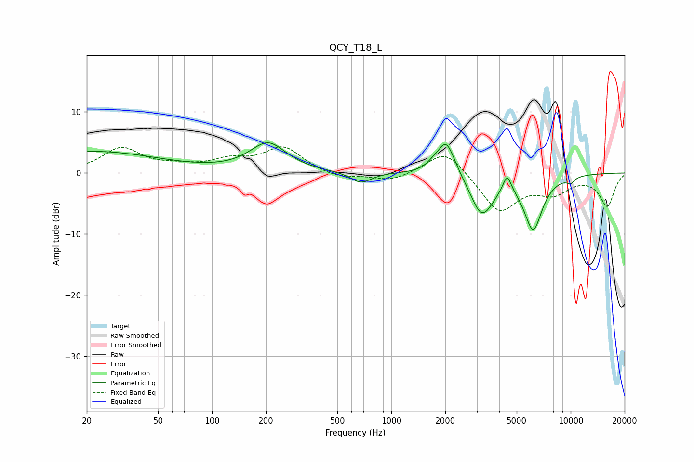

# QCY_T18_L
See [usage instructions](https://github.com/jaakkopasanen/AutoEq#usage) for more options and info.

### Parametric EQs
Apply preamp of -5.0 dB when using parametric equalizer.

|   # | Type    |   Fc (Hz) |    Q |   Gain (dB) |
|-----|---------|-----------|------|-------------|
|   1 | Peaking |        21 | 0.37 |         3.5 |
|   2 | Peaking |       205 | 1.4  |         4.7 |
|   3 | Peaking |       677 | 2.46 |        -1.8 |
|   4 | Peaking |      1712 | 3.96 |         0.7 |
|   5 | Peaking |      2024 | 2.92 |         5.7 |
|   6 | Peaking |      3151 | 2.34 |        -5.7 |
|   7 | Peaking |      3499 | 2.46 |        -1.3 |
|   8 | Peaking |      4426 | 5.95 |         2.9 |
|   9 | Peaking |      6181 | 2.64 |        -9   |
|  10 | Peaking |     10000 | 5.88 |        -0.9 |

### Fixed Band EQs
When using fixed band (also called graphic) equalizer, apply preamp of **-4.4 dB** (if available) and set gains manually with these parameters.

|   # | Type    |   Fc (Hz) |    Q |   Gain (dB) |
|-----|---------|-----------|------|-------------|
|   1 | Peaking |        31 | 1.41 |         4   |
|   2 | Peaking |        62 | 1.41 |         0.8 |
|   3 | Peaking |       125 | 1.41 |         1.8 |
|   4 | Peaking |       250 | 1.41 |         4.1 |
|   5 | Peaking |       500 | 1.41 |        -1   |
|   6 | Peaking |      1000 | 1.41 |        -1.4 |
|   7 | Peaking |      2000 | 1.41 |         4.1 |
|   8 | Peaking |      4000 | 1.41 |        -6.3 |
|   9 | Peaking |      8000 | 1.41 |        -2.8 |
|  10 | Peaking |     16000 | 1.41 |        -5.3 |

### Graphs

