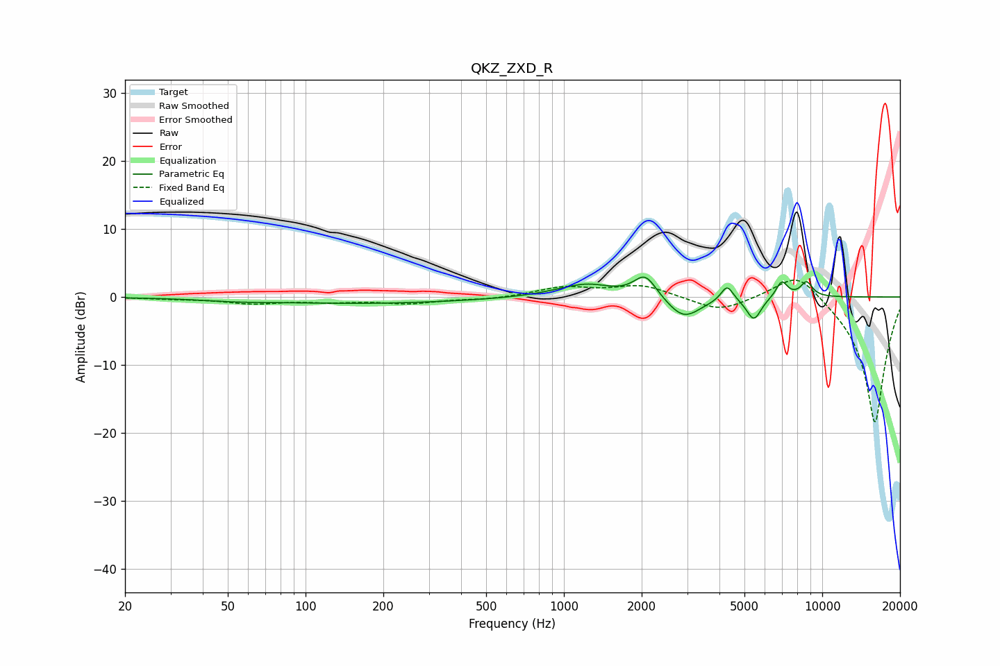

# QKZ_ZXD_R
See [usage instructions](https://github.com/jaakkopasanen/AutoEq#usage) for more options and info.

### Parametric EQs
Apply preamp of -3.0 dB when using parametric equalizer.

|   # | Type    |   Fc (Hz) |    Q |   Gain (dB) |
|-----|---------|-----------|------|-------------|
|   1 | Peaking |        53 | 1.12 |        -0.3 |
|   2 | Peaking |       170 | 0.36 |        -0.9 |
|   3 | Peaking |       914 | 1.44 |         0.3 |
|   4 | Peaking |      1234 | 1.5  |         1.8 |
|   5 | Peaking |      2065 | 3.21 |         3.4 |
|   6 | Peaking |      2911 | 2.17 |        -3.3 |
|   7 | Peaking |      4284 | 5.98 |         2.3 |
|   8 | Peaking |      5438 | 4.87 |        -3.4 |
|   9 | Peaking |      6972 | 6    |         2.4 |
|  10 | Peaking |      8692 | 5.53 |         2.2 |

### Fixed Band EQs
When using fixed band (also called graphic) equalizer, apply preamp of **-2.6 dB** (if available) and set gains manually with these parameters.

|   # | Type    |   Fc (Hz) |    Q |   Gain (dB) |
|-----|---------|-----------|------|-------------|
|   1 | Peaking |        31 | 1.41 |        -0.2 |
|   2 | Peaking |        62 | 1.41 |        -0.9 |
|   3 | Peaking |       125 | 1.41 |        -0.6 |
|   4 | Peaking |       250 | 1.41 |        -0.9 |
|   5 | Peaking |       500 | 1.41 |        -0.3 |
|   6 | Peaking |      1000 | 1.41 |         1.4 |
|   7 | Peaking |      2000 | 1.41 |         1.7 |
|   8 | Peaking |      4000 | 1.41 |        -2.1 |
|   9 | Peaking |      8000 | 1.41 |         4.3 |
|  10 | Peaking |     16000 | 1.41 |       -18.8 |

### Graphs

