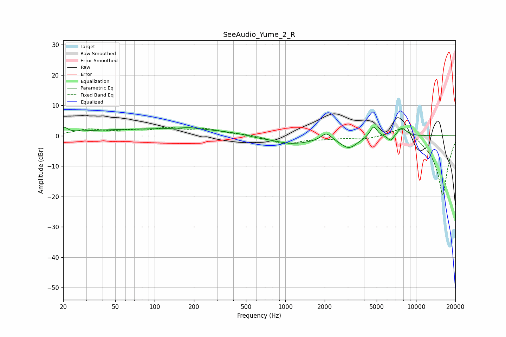

# SeeAudio_Yume_2_R
See [usage instructions](https://github.com/jaakkopasanen/AutoEq#usage) for more options and info.

### Parametric EQs
Apply preamp of -2.9 dB when using parametric equalizer.

|   # | Type    |   Fc (Hz) |    Q |   Gain (dB) |
|-----|---------|-----------|------|-------------|
|   1 | Peaking |        20 | 5.97 |         1.6 |
|   2 | Peaking |       113 | 0.18 |         2.2 |
|   3 | Peaking |       185 | 1.7  |         0.6 |
|   4 | Peaking |       601 | 1.7  |        -0.5 |
|   5 | Peaking |      1120 | 0.82 |        -2.9 |
|   6 | Peaking |      2057 | 3.66 |         2.6 |
|   7 | Peaking |      3067 | 2.21 |        -3.8 |
|   8 | Peaking |      4729 | 5.14 |         3.7 |
|   9 | Peaking |      6400 | 5.94 |        -2   |
|  10 | Peaking |      7785 | 3.88 |         2.8 |

### Fixed Band EQs
When using fixed band (also called graphic) equalizer, apply preamp of **-2.9 dB** (if available) and set gains manually with these parameters.

|   # | Type    |   Fc (Hz) |    Q |   Gain (dB) |
|-----|---------|-----------|------|-------------|
|   1 | Peaking |        31 | 1.41 |         1.9 |
|   2 | Peaking |        62 | 1.41 |         1.2 |
|   3 | Peaking |       125 | 1.41 |         2.2 |
|   4 | Peaking |       250 | 1.41 |         1.9 |
|   5 | Peaking |       500 | 1.41 |         0.4 |
|   6 | Peaking |      1000 | 1.41 |        -2.7 |
|   7 | Peaking |      2000 | 1.41 |        -0.8 |
|   8 | Peaking |      4000 | 1.41 |        -1   |
|   9 | Peaking |      8000 | 1.41 |         4   |
|  10 | Peaking |     16000 | 1.41 |       -20   |

### Graphs

