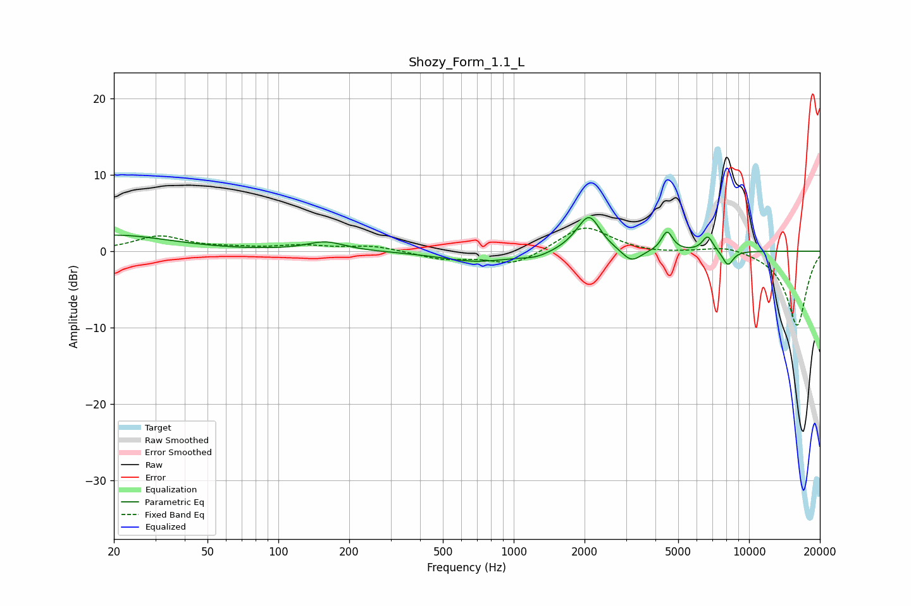

# Shozy_Form_1.1_L
See [usage instructions](https://github.com/jaakkopasanen/AutoEq#usage) for more options and info.

### Parametric EQs
Apply preamp of -4.5 dB when using parametric equalizer.

|   # | Type    |   Fc (Hz) |    Q |   Gain (dB) |
|-----|---------|-----------|------|-------------|
|   1 | Peaking |        20 | 0.6  |         2.1 |
|   2 | Peaking |       159 | 1.75 |         1.2 |
|   3 | Peaking |       703 | 0.92 |        -1.4 |
|   4 | Peaking |      1240 | 2.39 |        -0.6 |
|   5 | Peaking |      1862 | 2.4  |         0.6 |
|   6 | Peaking |      2098 | 3.04 |         4.3 |
|   7 | Peaking |      3165 | 3.47 |        -1.7 |
|   8 | Peaking |      4484 | 6    |         2.6 |
|   9 | Peaking |      6670 | 6    |         2   |
|  10 | Peaking |      8132 | 5.84 |        -2   |

### Fixed Band EQs
When using fixed band (also called graphic) equalizer, apply preamp of **-3.1 dB** (if available) and set gains manually with these parameters.

|   # | Type    |   Fc (Hz) |    Q |   Gain (dB) |
|-----|---------|-----------|------|-------------|
|   1 | Peaking |        31 | 1.41 |         1.9 |
|   2 | Peaking |        62 | 1.41 |         0.3 |
|   3 | Peaking |       125 | 1.41 |         0.7 |
|   4 | Peaking |       250 | 1.41 |         0.7 |
|   5 | Peaking |       500 | 1.41 |        -1   |
|   6 | Peaking |      1000 | 1.41 |        -1.8 |
|   7 | Peaking |      2000 | 1.41 |         3.4 |
|   8 | Peaking |      4000 | 1.41 |        -0.3 |
|   9 | Peaking |      8000 | 1.41 |         0.8 |
|  10 | Peaking |     16000 | 1.41 |        -9.8 |

### Graphs

