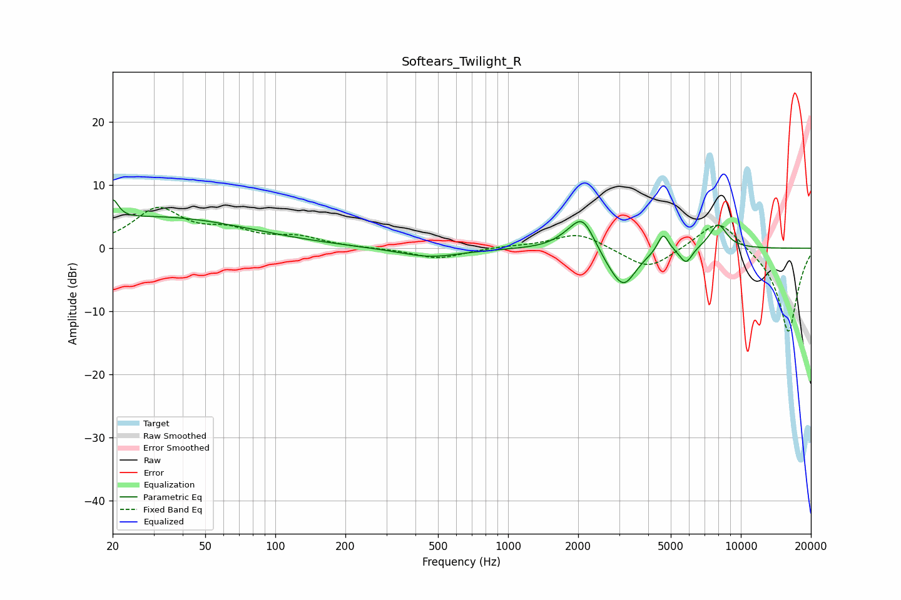

# Softears_Twilight_R
See [usage instructions](https://github.com/jaakkopasanen/AutoEq#usage) for more options and info.

### Parametric EQs
Apply preamp of -7.8 dB when using parametric equalizer.

|   # | Type    |   Fc (Hz) |    Q |   Gain (dB) |
|-----|---------|-----------|------|-------------|
|   1 | Peaking |        20 | 5.98 |         3.2 |
|   2 | Peaking |        31 | 0.35 |         4.9 |
|   3 | Peaking |       461 | 1.06 |        -1.5 |
|   4 | Peaking |      1830 | 2.21 |         1   |
|   5 | Peaking |      2096 | 2.73 |         4.9 |
|   6 | Peaking |      2752 | 2.15 |        -1.5 |
|   7 | Peaking |      3143 | 2.58 |        -5.4 |
|   8 | Peaking |      4637 | 5.94 |         3   |
|   9 | Peaking |      5815 | 5.15 |        -2.5 |
|  10 | Peaking |      7993 | 3.48 |         3.9 |

### Fixed Band EQs
When using fixed band (also called graphic) equalizer, apply preamp of **-6.6 dB** (if available) and set gains manually with these parameters.

|   # | Type    |   Fc (Hz) |    Q |   Gain (dB) |
|-----|---------|-----------|------|-------------|
|   1 | Peaking |        31 | 1.41 |         6   |
|   2 | Peaking |        62 | 1.41 |         2.3 |
|   3 | Peaking |       125 | 1.41 |         1.5 |
|   4 | Peaking |       250 | 1.41 |        -0   |
|   5 | Peaking |       500 | 1.41 |        -1.7 |
|   6 | Peaking |      1000 | 1.41 |         0.2 |
|   7 | Peaking |      2000 | 1.41 |         2.5 |
|   8 | Peaking |      4000 | 1.41 |        -3.5 |
|   9 | Peaking |      8000 | 1.41 |         5   |
|  10 | Peaking |     16000 | 1.41 |       -13.5 |

### Graphs

