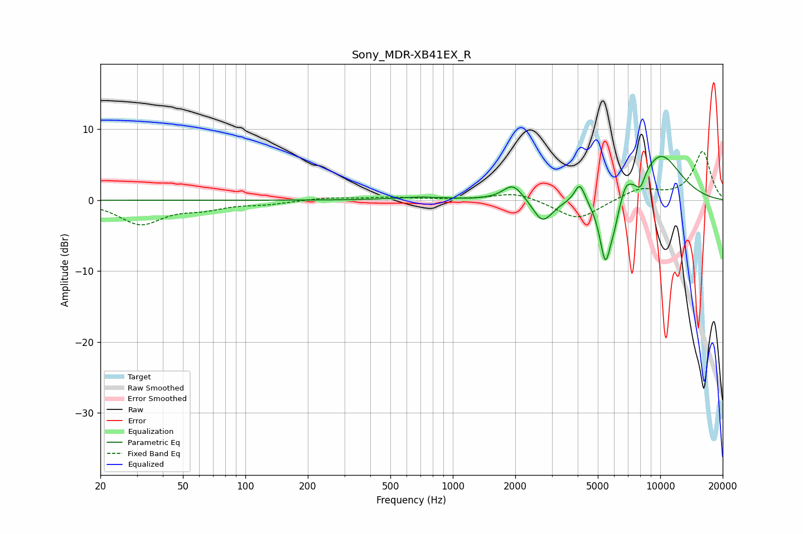

# Sony_MDR-XB41EX_R
See [usage instructions](https://github.com/jaakkopasanen/AutoEq#usage) for more options and info.

### Parametric EQs
Apply preamp of -6.3 dB when using parametric equalizer.

|   # | Type    |   Fc (Hz) |    Q |   Gain (dB) |
|-----|---------|-----------|------|-------------|
|   1 | Peaking |       696 | 1.22 |         0.4 |
|   2 | Peaking |      1951 | 2.93 |         2.3 |
|   3 | Peaking |      2679 | 3.31 |        -2.4 |
|   4 | Peaking |      2852 | 2.58 |        -1   |
|   5 | Peaking |      4093 | 5.63 |         2.7 |
|   6 | Peaking |      5443 | 4.6  |        -9.4 |
|   7 | Peaking |      6008 | 5.93 |        -2   |
|   8 | Peaking |      6844 | 6    |         1.4 |
|   9 | Peaking |      8027 | 5.93 |        -2.1 |
|  10 | Peaking |     10000 | 1.12 |         6.5 |

### Fixed Band EQs
When using fixed band (also called graphic) equalizer, apply preamp of **-7.0 dB** (if available) and set gains manually with these parameters.

|   # | Type    |   Fc (Hz) |    Q |   Gain (dB) |
|-----|---------|-----------|------|-------------|
|   1 | Peaking |        31 | 1.41 |        -3.3 |
|   2 | Peaking |        62 | 1.41 |        -1   |
|   3 | Peaking |       125 | 1.41 |        -0.5 |
|   4 | Peaking |       250 | 1.41 |         0.4 |
|   5 | Peaking |       500 | 1.41 |         0.4 |
|   6 | Peaking |      1000 | 1.41 |         0.1 |
|   7 | Peaking |      2000 | 1.41 |         1.1 |
|   8 | Peaking |      4000 | 1.41 |        -2.8 |
|   9 | Peaking |      8000 | 1.41 |         1.6 |
|  10 | Peaking |     16000 | 1.41 |         6.9 |

### Graphs

