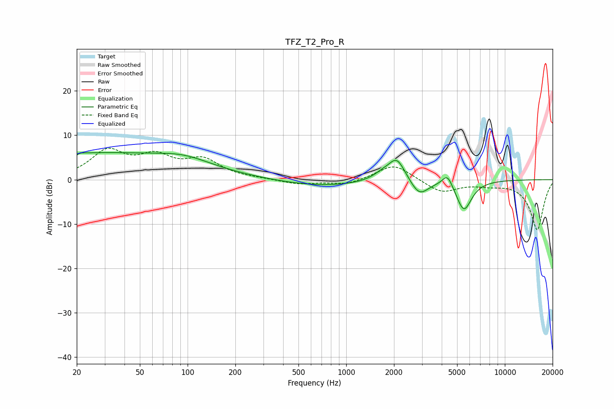

# TFZ_T2_Pro_R
See [usage instructions](https://github.com/jaakkopasanen/AutoEq#usage) for more options and info.

### Parametric EQs
Apply preamp of -6.2 dB when using parametric equalizer.

|   # | Type    |   Fc (Hz) |    Q |   Gain (dB) |
|-----|---------|-----------|------|-------------|
|   1 | Peaking |        20 | 6    |        -3.5 |
|   2 | Peaking |        20 | 5.96 |         3.1 |
|   3 | Peaking |        24 | 0.18 |         6   |
|   4 | Peaking |        96 | 0.91 |         1.6 |
|   5 | Peaking |       707 | 0.52 |        -1.5 |
|   6 | Peaking |      1710 | 2.18 |         1.5 |
|   7 | Peaking |      2089 | 2.73 |         4.9 |
|   8 | Peaking |      2891 | 2.55 |        -3.6 |
|   9 | Peaking |      4351 | 4.31 |         3   |
|  10 | Peaking |      5520 | 2.84 |        -6.9 |

### Fixed Band EQs
When using fixed band (also called graphic) equalizer, apply preamp of **-7.2 dB** (if available) and set gains manually with these parameters.

|   # | Type    |   Fc (Hz) |    Q |   Gain (dB) |
|-----|---------|-----------|------|-------------|
|   1 | Peaking |        31 | 1.41 |         6.1 |
|   2 | Peaking |        62 | 1.41 |         4.4 |
|   3 | Peaking |       125 | 1.41 |         4.1 |
|   4 | Peaking |       250 | 1.41 |         0.1 |
|   5 | Peaking |       500 | 1.41 |        -1   |
|   6 | Peaking |      1000 | 1.41 |        -1.2 |
|   7 | Peaking |      2000 | 1.41 |         3.6 |
|   8 | Peaking |      4000 | 1.41 |        -2.9 |
|   9 | Peaking |      8000 | 1.41 |        -0.9 |
|  10 | Peaking |     16000 | 1.41 |       -11.3 |

### Graphs

