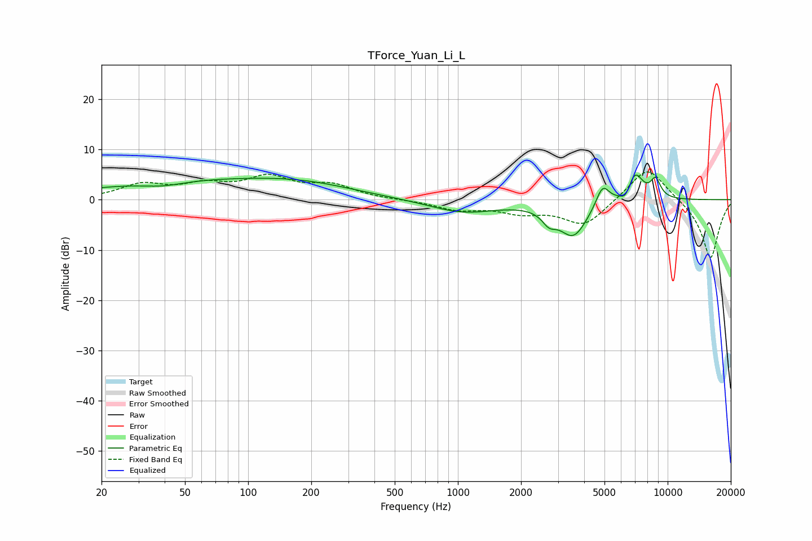

# TForce_Yuan_Li_L
See [usage instructions](https://github.com/jaakkopasanen/AutoEq#usage) for more options and info.

### Parametric EQs
Apply preamp of -5.0 dB when using parametric equalizer.

|   # | Type    |   Fc (Hz) |    Q |   Gain (dB) |
|-----|---------|-----------|------|-------------|
|   1 | Peaking |        39 | 1.37 |        -1   |
|   2 | Peaking |        61 | 0.26 |         3.8 |
|   3 | Peaking |       190 | 0.6  |         1.4 |
|   4 | Peaking |      1056 | 0.87 |        -2.5 |
|   5 | Peaking |      2719 | 4.35 |        -2.2 |
|   6 | Peaking |      3554 | 1.98 |        -7.1 |
|   7 | Peaking |      4895 | 4.26 |         4.4 |
|   8 | Peaking |      6313 | 5.58 |        -1.9 |
|   9 | Peaking |      6982 | 3.47 |         5.6 |
|  10 | Peaking |      8758 | 5.31 |         3.6 |

### Fixed Band EQs
When using fixed band (also called graphic) equalizer, apply preamp of **-5.6 dB** (if available) and set gains manually with these parameters.

|   # | Type    |   Fc (Hz) |    Q |   Gain (dB) |
|-----|---------|-----------|------|-------------|
|   1 | Peaking |        31 | 1.41 |         2.8 |
|   2 | Peaking |        62 | 1.41 |         2.5 |
|   3 | Peaking |       125 | 1.41 |         4   |
|   4 | Peaking |       250 | 1.41 |         2.6 |
|   5 | Peaking |       500 | 1.41 |        -0   |
|   6 | Peaking |      1000 | 1.41 |        -1.8 |
|   7 | Peaking |      2000 | 1.41 |        -2.1 |
|   8 | Peaking |      4000 | 1.41 |        -5.2 |
|   9 | Peaking |      8000 | 1.41 |         7.1 |
|  10 | Peaking |     16000 | 1.41 |       -11.9 |

### Graphs

