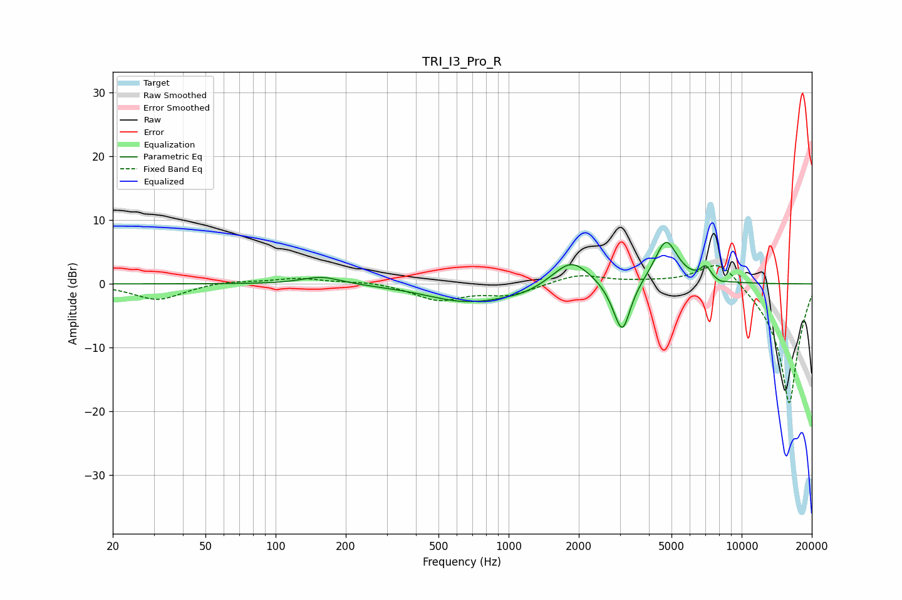

# TRI_I3_Pro_R
See [usage instructions](https://github.com/jaakkopasanen/AutoEq#usage) for more options and info.

### Parametric EQs
Apply preamp of -6.6 dB when using parametric equalizer.

|   # | Type    |   Fc (Hz) |    Q |   Gain (dB) |
|-----|---------|-----------|------|-------------|
|   1 | Peaking |       158 | 1.67 |         1.2 |
|   2 | Peaking |       567 | 1.25 |        -0.3 |
|   3 | Peaking |       705 | 0.76 |        -2.6 |
|   4 | Peaking |      1169 | 1.64 |        -0.6 |
|   5 | Peaking |      1858 | 1.77 |         4.2 |
|   6 | Peaking |      2900 | 3.31 |        -1.2 |
|   7 | Peaking |      3082 | 3.99 |        -7.4 |
|   8 | Peaking |      4735 | 2.81 |         6.9 |
|   9 | Peaking |      7007 | 6    |         2   |
|  10 | Peaking |      8118 | 6    |        -0.3 |

### Fixed Band EQs
When using fixed band (also called graphic) equalizer, apply preamp of **-3.0 dB** (if available) and set gains manually with these parameters.

|   # | Type    |   Fc (Hz) |    Q |   Gain (dB) |
|-----|---------|-----------|------|-------------|
|   1 | Peaking |        31 | 1.41 |        -2.5 |
|   2 | Peaking |        62 | 1.41 |         0.5 |
|   3 | Peaking |       125 | 1.41 |         0.9 |
|   4 | Peaking |       250 | 1.41 |         0.4 |
|   5 | Peaking |       500 | 1.41 |        -2.5 |
|   6 | Peaking |      1000 | 1.41 |        -1.7 |
|   7 | Peaking |      2000 | 1.41 |         1.5 |
|   8 | Peaking |      4000 | 1.41 |         0.3 |
|   9 | Peaking |      8000 | 1.41 |         4.4 |
|  10 | Peaking |     16000 | 1.41 |       -19.1 |

### Graphs

