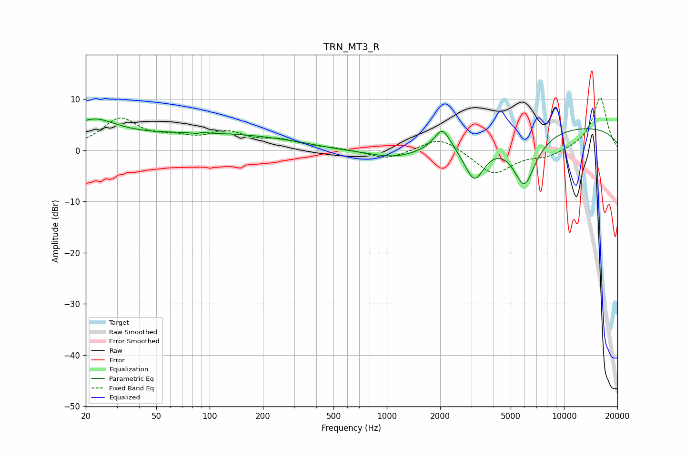

# TRN_MT3_R
See [usage instructions](https://github.com/jaakkopasanen/AutoEq#usage) for more options and info.

### Parametric EQs
Apply preamp of -6.2 dB when using parametric equalizer.

|   # | Type    |   Fc (Hz) |    Q |   Gain (dB) |
|-----|---------|-----------|------|-------------|
|   1 | Peaking |        22 | 1.04 |         4.8 |
|   2 | Peaking |        89 | 5.54 |        -2.5 |
|   3 | Peaking |        89 | 5.9  |         2.5 |
|   4 | Peaking |       100 | 0.27 |         3.2 |
|   5 | Peaking |       497 | 0.96 |        -0.4 |
|   6 | Peaking |      1155 | 0.85 |        -2.5 |
|   7 | Peaking |      2059 | 3.24 |         4.1 |
|   8 | Peaking |      3119 | 2.3  |        -8.1 |
|   9 | Peaking |      5972 | 2.01 |       -10.5 |
|  10 | Peaking |      8928 | 0.18 |         5   |

### Fixed Band EQs
When using fixed band (also called graphic) equalizer, apply preamp of **-10.3 dB** (if available) and set gains manually with these parameters.

|   # | Type    |   Fc (Hz) |    Q |   Gain (dB) |
|-----|---------|-----------|------|-------------|
|   1 | Peaking |        31 | 1.41 |         5.9 |
|   2 | Peaking |        62 | 1.41 |         1.7 |
|   3 | Peaking |       125 | 1.41 |         3   |
|   4 | Peaking |       250 | 1.41 |         1.6 |
|   5 | Peaking |       500 | 1.41 |         0.3 |
|   6 | Peaking |      1000 | 1.41 |        -1.8 |
|   7 | Peaking |      2000 | 1.41 |         2.8 |
|   8 | Peaking |      4000 | 1.41 |        -4.8 |
|   9 | Peaking |      8000 | 1.41 |        -1.2 |
|  10 | Peaking |     16000 | 1.41 |        10.4 |

### Graphs

