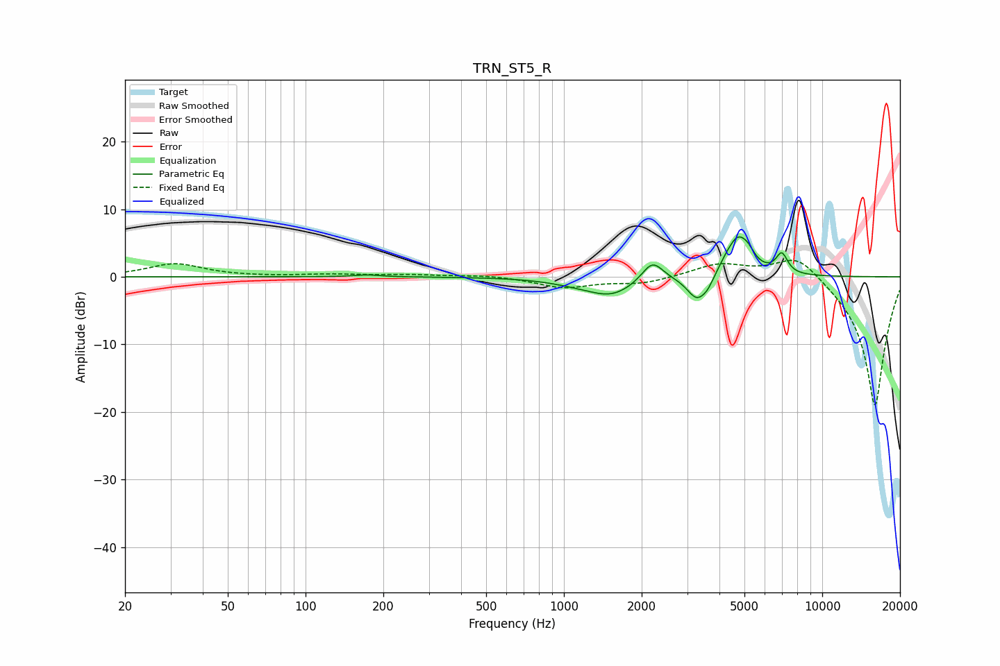

# TRN_ST5_R
See [usage instructions](https://github.com/jaakkopasanen/AutoEq#usage) for more options and info.

### Parametric EQs
Apply preamp of -6.0 dB when using parametric equalizer.

|   # | Type    |   Fc (Hz) |    Q |   Gain (dB) |
|-----|---------|-----------|------|-------------|
|   1 | Peaking |       173 | 2.9  |         0.3 |
|   2 | Peaking |      1104 | 1.32 |        -0.5 |
|   3 | Peaking |      1533 | 1.51 |        -2.6 |
|   4 | Peaking |      2200 | 3.39 |         3.1 |
|   5 | Peaking |      3276 | 3.65 |        -3.6 |
|   6 | Peaking |      3609 | 6    |        -1.1 |
|   7 | Peaking |      4214 | 5.63 |         0.5 |
|   8 | Peaking |      4711 | 3.06 |         5.7 |
|   9 | Peaking |      5176 | 6    |         1   |
|  10 | Peaking |      6971 | 6    |         2.9 |

### Fixed Band EQs
When using fixed band (also called graphic) equalizer, apply preamp of **-2.5 dB** (if available) and set gains manually with these parameters.

|   # | Type    |   Fc (Hz) |    Q |   Gain (dB) |
|-----|---------|-----------|------|-------------|
|   1 | Peaking |        31 | 1.41 |         1.9 |
|   2 | Peaking |        62 | 1.41 |         0   |
|   3 | Peaking |       125 | 1.41 |         0.3 |
|   4 | Peaking |       250 | 1.41 |         0.3 |
|   5 | Peaking |       500 | 1.41 |         0.3 |
|   6 | Peaking |      1000 | 1.41 |        -1.6 |
|   7 | Peaking |      2000 | 1.41 |        -1   |
|   8 | Peaking |      4000 | 1.41 |         1.9 |
|   9 | Peaking |      8000 | 1.41 |         3.7 |
|  10 | Peaking |     16000 | 1.41 |       -19.4 |

### Graphs

