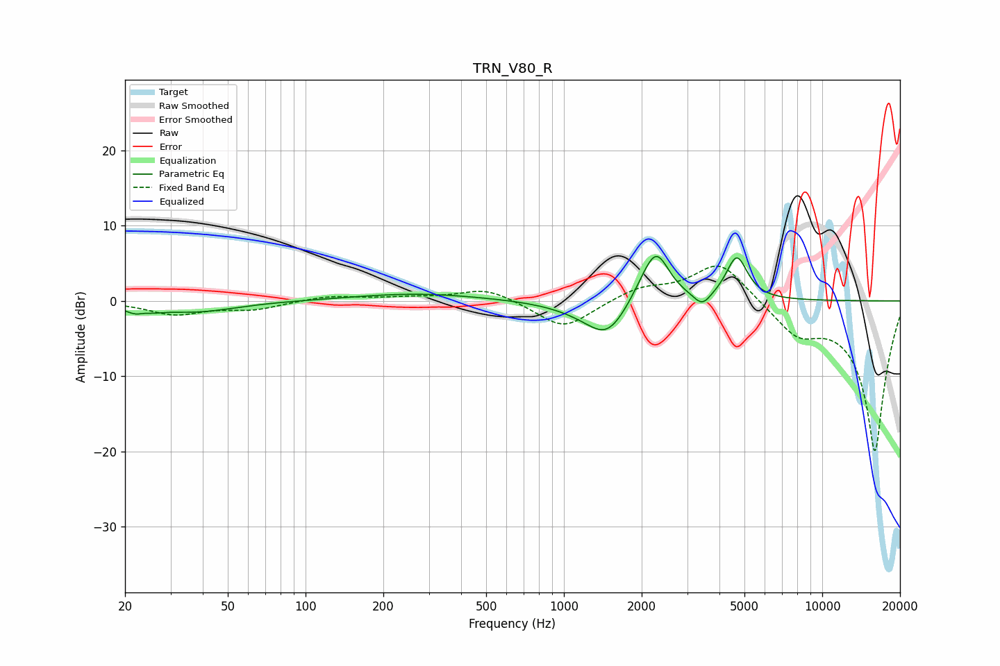

# TRN_V80_R
See [usage instructions](https://github.com/jaakkopasanen/AutoEq#usage) for more options and info.

### Parametric EQs
Apply preamp of -6.0 dB when using parametric equalizer.

|   # | Type    |   Fc (Hz) |    Q |   Gain (dB) |
|-----|---------|-----------|------|-------------|
|   1 | Peaking |        23 | 3    |        -1.7 |
|   2 | Peaking |        24 | 5.16 |         0.7 |
|   3 | Peaking |        38 | 0.9  |        -1.4 |
|   4 | Peaking |       271 | 0.58 |         1   |
|   5 | Peaking |      1194 | 1.13 |        -0.9 |
|   6 | Peaking |      1471 | 1.79 |        -4.4 |
|   7 | Peaking |      2055 | 2.42 |         1.8 |
|   8 | Peaking |      2288 | 2.8  |         5.8 |
|   9 | Peaking |      3434 | 4.22 |        -1.8 |
|  10 | Peaking |      4670 | 3.41 |         5.8 |

### Fixed Band EQs
When using fixed band (also called graphic) equalizer, apply preamp of **-4.7 dB** (if available) and set gains manually with these parameters.

|   # | Type    |   Fc (Hz) |    Q |   Gain (dB) |
|-----|---------|-----------|------|-------------|
|   1 | Peaking |        31 | 1.41 |        -1.7 |
|   2 | Peaking |        62 | 1.41 |        -1   |
|   3 | Peaking |       125 | 1.41 |         0.7 |
|   4 | Peaking |       250 | 1.41 |         0.4 |
|   5 | Peaking |       500 | 1.41 |         1.7 |
|   6 | Peaking |      1000 | 1.41 |        -3.8 |
|   7 | Peaking |      2000 | 1.41 |         1.7 |
|   8 | Peaking |      4000 | 1.41 |         5.4 |
|   9 | Peaking |      8000 | 1.41 |        -3.8 |
|  10 | Peaking |     16000 | 1.41 |       -20   |

### Graphs

