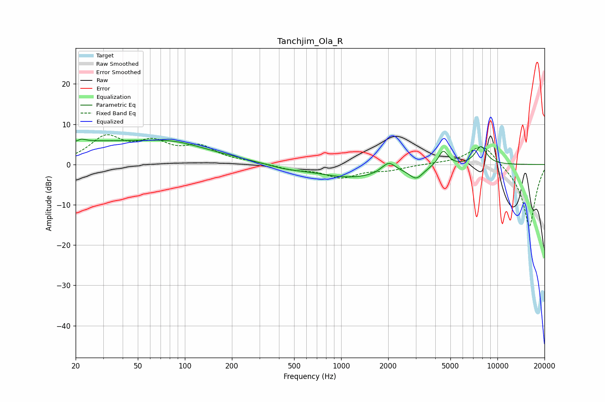

# Tanchjim_Ola_R
See [usage instructions](https://github.com/jaakkopasanen/AutoEq#usage) for more options and info.

### Parametric EQs
Apply preamp of -6.4 dB when using parametric equalizer.

|   # | Type    |   Fc (Hz) |    Q |   Gain (dB) |
|-----|---------|-----------|------|-------------|
|   1 | Peaking |        21 | 5.98 |        -3.1 |
|   2 | Peaking |        21 | 5.01 |         3.6 |
|   3 | Peaking |        32 | 0.2  |         5.6 |
|   4 | Peaking |        86 | 0.88 |         1.2 |
|   5 | Peaking |       429 | 1.22 |        -0.8 |
|   6 | Peaking |      1185 | 0.59 |        -3.3 |
|   7 | Peaking |      2011 | 3.18 |         2.7 |
|   8 | Peaking |      3024 | 3.24 |        -2.8 |
|   9 | Peaking |      4499 | 4.54 |         3.9 |
|  10 | Peaking |      7832 | 3.53 |         4.5 |

### Fixed Band EQs
When using fixed band (also called graphic) equalizer, apply preamp of **-7.5 dB** (if available) and set gains manually with these parameters.

|   # | Type    |   Fc (Hz) |    Q |   Gain (dB) |
|-----|---------|-----------|------|-------------|
|   1 | Peaking |        31 | 1.41 |         6.4 |
|   2 | Peaking |        62 | 1.41 |         4.6 |
|   3 | Peaking |       125 | 1.41 |         3.9 |
|   4 | Peaking |       250 | 1.41 |         0.5 |
|   5 | Peaking |       500 | 1.41 |        -1.1 |
|   6 | Peaking |      1000 | 1.41 |        -3   |
|   7 | Peaking |      2000 | 1.41 |        -1.2 |
|   8 | Peaking |      4000 | 1.41 |         0.2 |
|   9 | Peaking |      8000 | 1.41 |         5.5 |
|  10 | Peaking |     16000 | 1.41 |       -15.7 |

### Graphs

