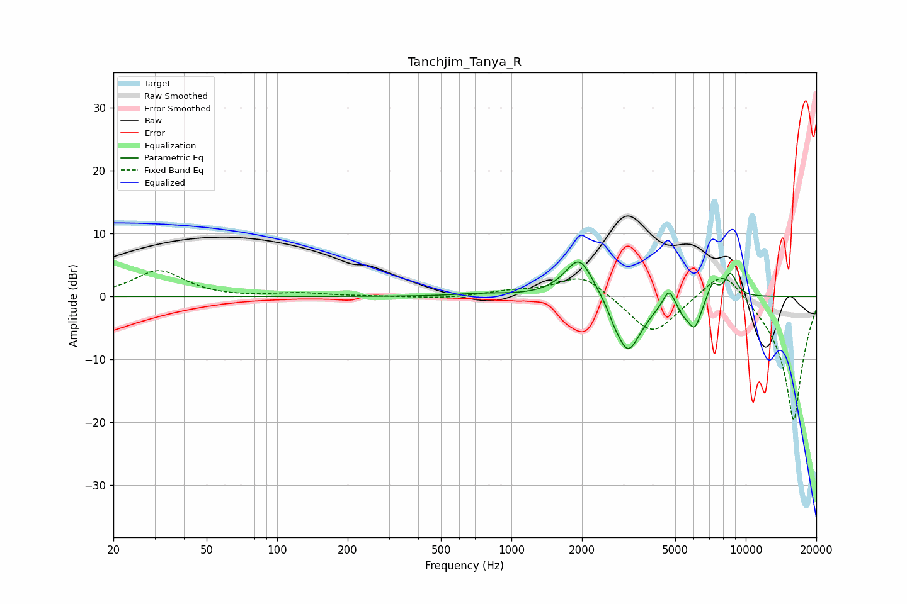

# Tanchjim_Tanya_R
See [usage instructions](https://github.com/jaakkopasanen/AutoEq#usage) for more options and info.

### Parametric EQs
Apply preamp of -5.6 dB when using parametric equalizer.

|   # | Type    |   Fc (Hz) |    Q |   Gain (dB) |
|-----|---------|-----------|------|-------------|
|   1 | Peaking |       732 | 1.41 |         0.4 |
|   2 | Peaking |      1949 | 2.27 |         6.7 |
|   3 | Peaking |      2749 | 6    |        -0.9 |
|   4 | Peaking |      3119 | 2.73 |        -7.9 |
|   5 | Peaking |      3473 | 2.18 |        -1.6 |
|   6 | Peaking |      4696 | 5.96 |         2.8 |
|   7 | Peaking |      5405 | 5.96 |        -1.3 |
|   8 | Peaking |      6046 | 4.72 |        -4.7 |
|   9 | Peaking |      7199 | 6    |         2.6 |
|  10 | Peaking |      8608 | 4.95 |         3.8 |

### Fixed Band EQs
When using fixed band (also called graphic) equalizer, apply preamp of **-4.2 dB** (if available) and set gains manually with these parameters.

|   # | Type    |   Fc (Hz) |    Q |   Gain (dB) |
|-----|---------|-----------|------|-------------|
|   1 | Peaking |        31 | 1.41 |         4.1 |
|   2 | Peaking |        62 | 1.41 |        -0.2 |
|   3 | Peaking |       125 | 1.41 |         0.5 |
|   4 | Peaking |       250 | 1.41 |         0   |
|   5 | Peaking |       500 | 1.41 |        -0.3 |
|   6 | Peaking |      1000 | 1.41 |         0.7 |
|   7 | Peaking |      2000 | 1.41 |         3.7 |
|   8 | Peaking |      4000 | 1.41 |        -6.3 |
|   9 | Peaking |      8000 | 1.41 |         5.5 |
|  10 | Peaking |     16000 | 1.41 |       -20   |

### Graphs

