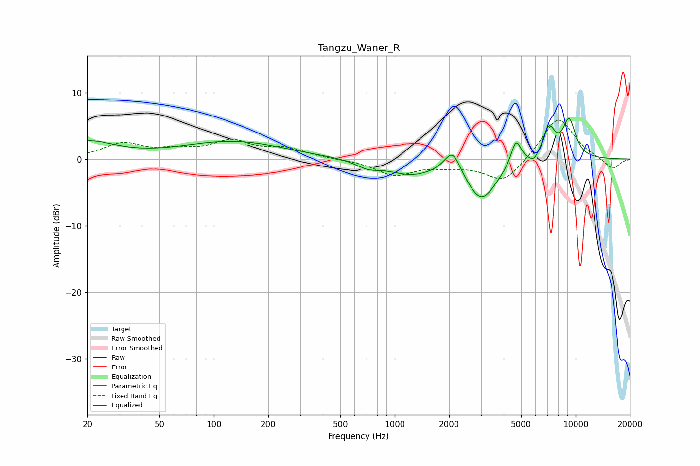

# Tangzu_Waner_R
See [usage instructions](https://github.com/jaakkopasanen/AutoEq#usage) for more options and info.

### Parametric EQs
Apply preamp of -6.1 dB when using parametric equalizer.

|   # | Type    |   Fc (Hz) |    Q |   Gain (dB) |
|-----|---------|-----------|------|-------------|
|   1 | Peaking |        20 | 0.96 |         2.5 |
|   2 | Peaking |       128 | 0.5  |         2.6 |
|   3 | Peaking |       710 | 2.23 |        -1   |
|   4 | Peaking |      1228 | 1.08 |        -2.1 |
|   5 | Peaking |      2089 | 3.17 |         3.6 |
|   6 | Peaking |      3016 | 1.66 |        -6.1 |
|   7 | Peaking |      4683 | 4.92 |         3.9 |
|   8 | Peaking |      5881 | 5.51 |        -1.1 |
|   9 | Peaking |      7123 | 3.84 |         4.5 |
|  10 | Peaking |      9216 | 3.43 |         5.7 |

### Fixed Band EQs
When using fixed band (also called graphic) equalizer, apply preamp of **-5.9 dB** (if available) and set gains manually with these parameters.

|   # | Type    |   Fc (Hz) |    Q |   Gain (dB) |
|-----|---------|-----------|------|-------------|
|   1 | Peaking |        31 | 1.41 |         2.2 |
|   2 | Peaking |        62 | 1.41 |         1.1 |
|   3 | Peaking |       125 | 1.41 |         2.5 |
|   4 | Peaking |       250 | 1.41 |         1.4 |
|   5 | Peaking |       500 | 1.41 |        -0   |
|   6 | Peaking |      1000 | 1.41 |        -2.3 |
|   7 | Peaking |      2000 | 1.41 |        -0.8 |
|   8 | Peaking |      4000 | 1.41 |        -3.6 |
|   9 | Peaking |      8000 | 1.41 |         6.5 |
|  10 | Peaking |     16000 | 1.41 |        -1.7 |

### Graphs

