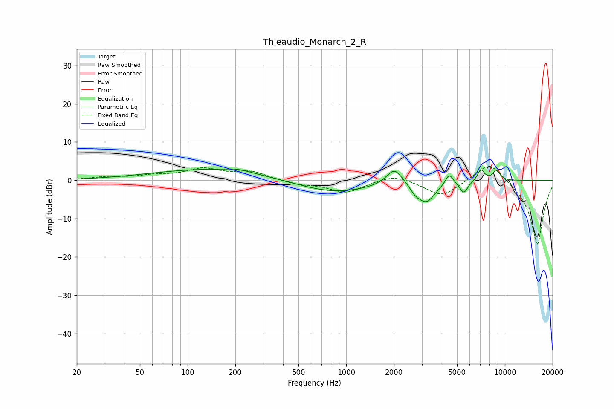

# Thieaudio_Monarch_2_R
See [usage instructions](https://github.com/jaakkopasanen/AutoEq#usage) for more options and info.

### Parametric EQs
Apply preamp of -3.1 dB when using parametric equalizer.

|   # | Type    |   Fc (Hz) |    Q |   Gain (dB) |
|-----|---------|-----------|------|-------------|
|   1 | Peaking |       140 | 0.38 |         2.9 |
|   2 | Peaking |       207 | 1.94 |         0.7 |
|   3 | Peaking |       831 | 0.61 |        -3.3 |
|   4 | Peaking |      2016 | 2.8  |         4.5 |
|   5 | Peaking |      2724 | 4.26 |        -1.5 |
|   6 | Peaking |      3203 | 2.54 |        -5.2 |
|   7 | Peaking |      4459 | 5.93 |         2.9 |
|   8 | Peaking |      5517 | 5.51 |        -3.1 |
|   9 | Peaking |      7072 | 5.97 |         3   |
|  10 | Peaking |      8834 | 5.79 |         2.7 |

### Fixed Band EQs
When using fixed band (also called graphic) equalizer, apply preamp of **-3.6 dB** (if available) and set gains manually with these parameters.

|   # | Type    |   Fc (Hz) |    Q |   Gain (dB) |
|-----|---------|-----------|------|-------------|
|   1 | Peaking |        31 | 1.41 |         0.7 |
|   2 | Peaking |        62 | 1.41 |         1   |
|   3 | Peaking |       125 | 1.41 |         2.7 |
|   4 | Peaking |       250 | 1.41 |         2.1 |
|   5 | Peaking |       500 | 1.41 |        -1   |
|   6 | Peaking |      1000 | 1.41 |        -3.1 |
|   7 | Peaking |      2000 | 1.41 |         1.8 |
|   8 | Peaking |      4000 | 1.41 |        -4.3 |
|   9 | Peaking |      8000 | 1.41 |         5.5 |
|  10 | Peaking |     16000 | 1.41 |       -17   |

### Graphs

