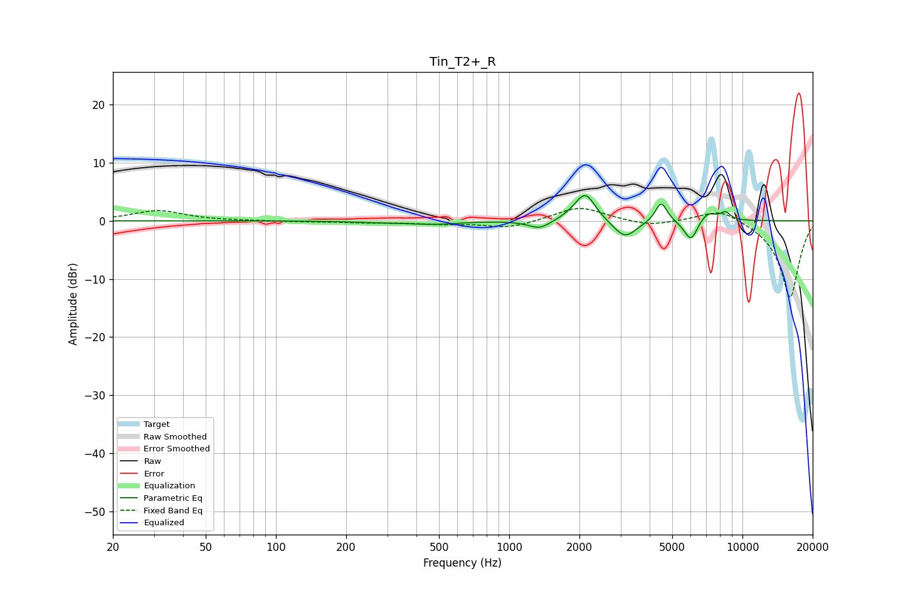

# Tin_T2+_R
See [usage instructions](https://github.com/jaakkopasanen/AutoEq#usage) for more options and info.

### Parametric EQs
Apply preamp of -4.4 dB when using parametric equalizer.

|   # | Type    |   Fc (Hz) |    Q |   Gain (dB) |
|-----|---------|-----------|------|-------------|
|   1 | Peaking |       287 | 1.08 |        -0.2 |
|   2 | Peaking |       481 | 1.39 |        -0.5 |
|   3 | Peaking |      1350 | 2.98 |        -1.5 |
|   4 | Peaking |      1965 | 2.73 |         0.9 |
|   5 | Peaking |      2130 | 3.41 |         4.2 |
|   6 | Peaking |      3135 | 2.87 |        -3.1 |
|   7 | Peaking |      4484 | 5.56 |         3.5 |
|   8 | Peaking |      6017 | 4.65 |        -3.7 |
|   9 | Peaking |      7071 | 3.5  |         1.7 |
|  10 | Peaking |      8452 | 6    |         1.3 |

### Fixed Band EQs
When using fixed band (also called graphic) equalizer, apply preamp of **-2.2 dB** (if available) and set gains manually with these parameters.

|   # | Type    |   Fc (Hz) |    Q |   Gain (dB) |
|-----|---------|-----------|------|-------------|
|   1 | Peaking |        31 | 1.41 |         1.8 |
|   2 | Peaking |        62 | 1.41 |        -0   |
|   3 | Peaking |       125 | 1.41 |        -0.1 |
|   4 | Peaking |       250 | 1.41 |        -0.3 |
|   5 | Peaking |       500 | 1.41 |        -0.4 |
|   6 | Peaking |      1000 | 1.41 |        -1.3 |
|   7 | Peaking |      2000 | 1.41 |         2.5 |
|   8 | Peaking |      4000 | 1.41 |        -1   |
|   9 | Peaking |      8000 | 1.41 |         2.3 |
|  10 | Peaking |     16000 | 1.41 |       -13.3 |

### Graphs

