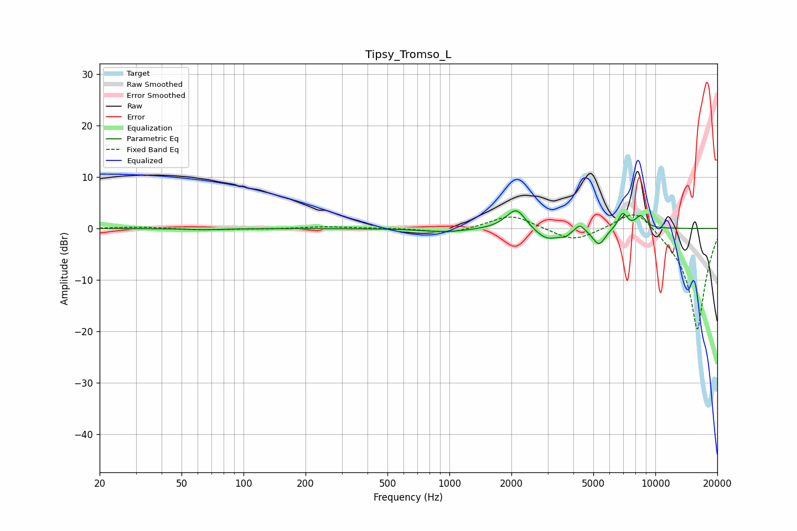

# Tipsy_Tromso_L
See [usage instructions](https://github.com/jaakkopasanen/AutoEq#usage) for more options and info.

### Parametric EQs
Apply preamp of -3.5 dB when using parametric equalizer.

|   # | Type    |   Fc (Hz) |    Q |   Gain (dB) |
|-----|---------|-----------|------|-------------|
|   1 | Peaking |        65 | 1.52 |        -0.2 |
|   2 | Peaking |       959 | 1.26 |        -0.7 |
|   3 | Peaking |      2011 | 2.37 |         0.9 |
|   4 | Peaking |      2121 | 3.24 |         3.4 |
|   5 | Peaking |      2982 | 2.35 |        -2.4 |
|   6 | Peaking |      3648 | 5.88 |        -0.8 |
|   7 | Peaking |      4298 | 6    |         1.5 |
|   8 | Peaking |      5329 | 4.48 |        -3.2 |
|   9 | Peaking |      6939 | 6    |         3.1 |
|  10 | Peaking |      8495 | 5.34 |         2.4 |

### Fixed Band EQs
When using fixed band (also called graphic) equalizer, apply preamp of **-2.7 dB** (if available) and set gains manually with these parameters.

|   # | Type    |   Fc (Hz) |    Q |   Gain (dB) |
|-----|---------|-----------|------|-------------|
|   1 | Peaking |        31 | 1.41 |         0.3 |
|   2 | Peaking |        62 | 1.41 |        -0.3 |
|   3 | Peaking |       125 | 1.41 |        -0.1 |
|   4 | Peaking |       250 | 1.41 |         0.4 |
|   5 | Peaking |       500 | 1.41 |         0.1 |
|   6 | Peaking |      1000 | 1.41 |        -1.1 |
|   7 | Peaking |      2000 | 1.41 |         2.8 |
|   8 | Peaking |      4000 | 1.41 |        -2.6 |
|   9 | Peaking |      8000 | 1.41 |         4.7 |
|  10 | Peaking |     16000 | 1.41 |       -20   |

### Graphs

