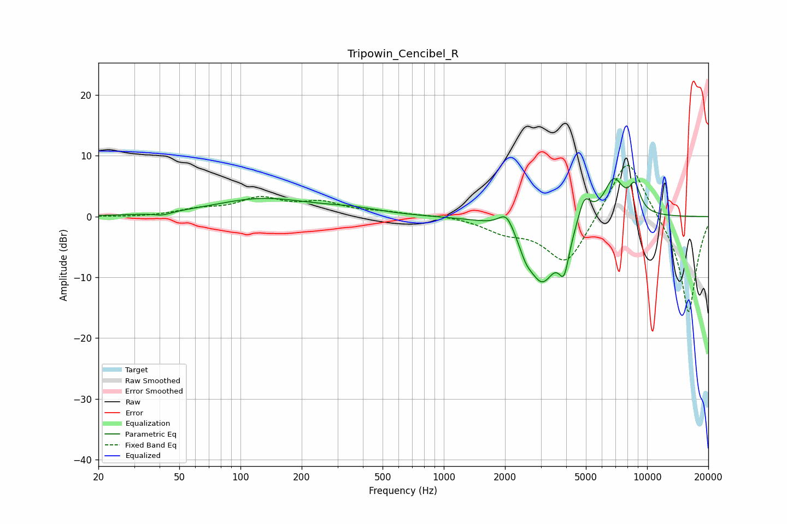

# Tripowin_Cencibel_R
See [usage instructions](https://github.com/jaakkopasanen/AutoEq#usage) for more options and info.

### Parametric EQs
Apply preamp of -6.3 dB when using parametric equalizer.

|   # | Type    |   Fc (Hz) |    Q |   Gain (dB) |
|-----|---------|-----------|------|-------------|
|   1 | Peaking |        41 | 3.39 |        -0.5 |
|   2 | Peaking |       128 | 0.59 |         2.9 |
|   3 | Peaking |       358 | 1.04 |         0.8 |
|   4 | Peaking |      2037 | 3.56 |         3.2 |
|   5 | Peaking |      2534 | 4.19 |        -2.1 |
|   6 | Peaking |      3050 | 1.88 |       -10.3 |
|   7 | Peaking |      3904 | 5.48 |        -5.7 |
|   8 | Peaking |      4912 | 4.4  |         4.4 |
|   9 | Peaking |      6851 | 2.69 |         6.3 |
|  10 | Peaking |      8701 | 4.68 |         4.2 |

### Fixed Band EQs
When using fixed band (also called graphic) equalizer, apply preamp of **-8.5 dB** (if available) and set gains manually with these parameters.

|   # | Type    |   Fc (Hz) |    Q |   Gain (dB) |
|-----|---------|-----------|------|-------------|
|   1 | Peaking |        31 | 1.41 |        -0.1 |
|   2 | Peaking |        62 | 1.41 |         1   |
|   3 | Peaking |       125 | 1.41 |         2.7 |
|   4 | Peaking |       250 | 1.41 |         2   |
|   5 | Peaking |       500 | 1.41 |         0.6 |
|   6 | Peaking |      1000 | 1.41 |         0.3 |
|   7 | Peaking |      2000 | 1.41 |        -2.1 |
|   8 | Peaking |      4000 | 1.41 |        -8.3 |
|   9 | Peaking |      8000 | 1.41 |        11   |
|  10 | Peaking |     16000 | 1.41 |       -16.4 |

### Graphs

