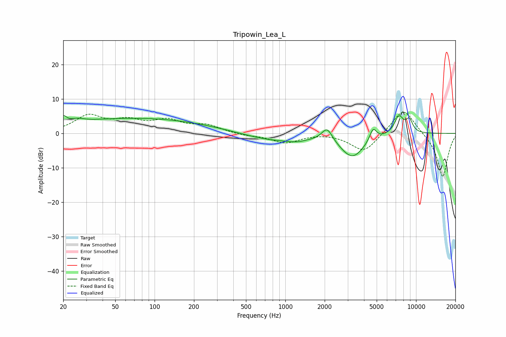

# Tripowin_Lea_L
See [usage instructions](https://github.com/jaakkopasanen/AutoEq#usage) for more options and info.

### Parametric EQs
Apply preamp of -5.3 dB when using parametric equalizer.

|   # | Type    |   Fc (Hz) |    Q |   Gain (dB) |
|-----|---------|-----------|------|-------------|
|   1 | Peaking |        20 | 6    |         2.1 |
|   2 | Peaking |        25 | 2.59 |         1   |
|   3 | Peaking |        73 | 0.24 |         4.4 |
|   4 | Peaking |       778 | 0.66 |        -2.1 |
|   5 | Peaking |      1223 | 1.81 |        -0.9 |
|   6 | Peaking |      2088 | 3.43 |         4   |
|   7 | Peaking |      3255 | 1.45 |        -6.9 |
|   8 | Peaking |      4691 | 5.18 |         3.7 |
|   9 | Peaking |      7402 | 3.61 |         5.2 |
|  10 | Peaking |      8893 | 5.05 |         3.5 |

### Fixed Band EQs
When using fixed band (also called graphic) equalizer, apply preamp of **-6.2 dB** (if available) and set gains manually with these parameters.

|   # | Type    |   Fc (Hz) |    Q |   Gain (dB) |
|-----|---------|-----------|------|-------------|
|   1 | Peaking |        31 | 1.41 |         4.8 |
|   2 | Peaking |        62 | 1.41 |         3   |
|   3 | Peaking |       125 | 1.41 |         3.3 |
|   4 | Peaking |       250 | 1.41 |         2.1 |
|   5 | Peaking |       500 | 1.41 |        -0.6 |
|   6 | Peaking |      1000 | 1.41 |        -2.7 |
|   7 | Peaking |      2000 | 1.41 |         0.3 |
|   8 | Peaking |      4000 | 1.41 |        -5.6 |
|   9 | Peaking |      8000 | 1.41 |         7.8 |
|  10 | Peaking |     16000 | 1.41 |       -12.9 |

### Graphs

