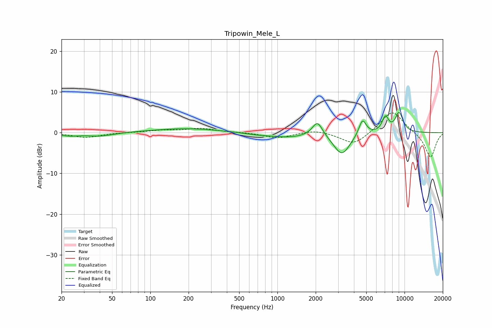

# Tripowin_Mele_L
See [usage instructions](https://github.com/jaakkopasanen/AutoEq#usage) for more options and info.

### Parametric EQs
Apply preamp of -5.1 dB when using parametric equalizer.

|   # | Type    |   Fc (Hz) |    Q |   Gain (dB) |
|-----|---------|-----------|------|-------------|
|   1 | Peaking |        23 | 1.93 |        -0.7 |
|   2 | Peaking |        40 | 1.37 |        -0.9 |
|   3 | Peaking |       190 | 0.53 |         1   |
|   4 | Peaking |       677 | 1.36 |        -0.4 |
|   5 | Peaking |      1216 | 0.96 |        -1   |
|   6 | Peaking |      2066 | 3.48 |         3.7 |
|   7 | Peaking |      3212 | 2.14 |        -5.4 |
|   8 | Peaking |      4671 | 4.76 |         4   |
|   9 | Peaking |      7068 | 5.26 |         3.7 |
|  10 | Peaking |      9061 | 4.08 |         4.8 |

### Fixed Band EQs
When using fixed band (also called graphic) equalizer, apply preamp of **-4.9 dB** (if available) and set gains manually with these parameters.

|   # | Type    |   Fc (Hz) |    Q |   Gain (dB) |
|-----|---------|-----------|------|-------------|
|   1 | Peaking |        31 | 1.41 |        -1.2 |
|   2 | Peaking |        62 | 1.41 |         0   |
|   3 | Peaking |       125 | 1.41 |         0.6 |
|   4 | Peaking |       250 | 1.41 |         1   |
|   5 | Peaking |       500 | 1.41 |         0.1 |
|   6 | Peaking |      1000 | 1.41 |        -1.3 |
|   7 | Peaking |      2000 | 1.41 |         0.8 |
|   8 | Peaking |      4000 | 1.41 |        -3.1 |
|   9 | Peaking |      8000 | 1.41 |         5.6 |
|  10 | Peaking |     16000 | 1.41 |        -6.2 |

### Graphs

