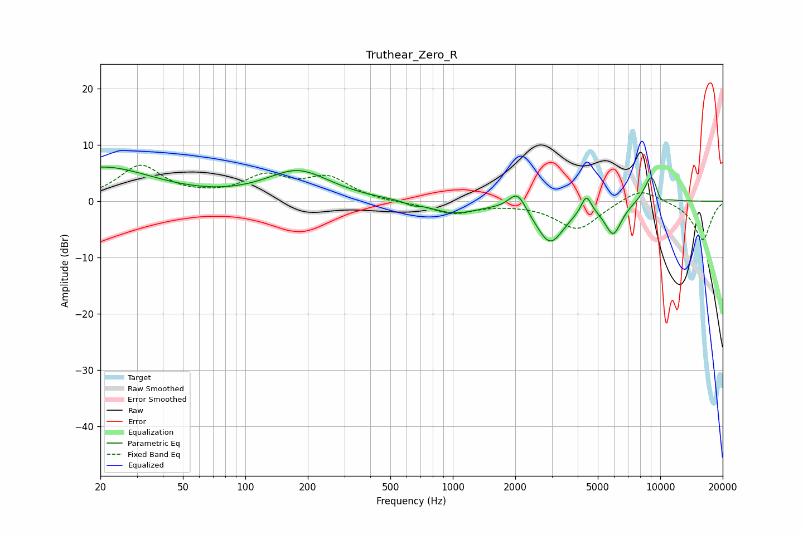

# Truthear_Zero_R
See [usage instructions](https://github.com/jaakkopasanen/AutoEq#usage) for more options and info.

### Parametric EQs
Apply preamp of -6.1 dB when using parametric equalizer.

|   # | Type    |   Fc (Hz) |    Q |   Gain (dB) |
|-----|---------|-----------|------|-------------|
|   1 | Peaking |        20 | 0.56 |         6   |
|   2 | Peaking |       180 | 0.91 |         5.2 |
|   3 | Peaking |       636 | 5.27 |        -0.5 |
|   4 | Peaking |      1008 | 1.26 |        -2.1 |
|   5 | Peaking |      2049 | 3.44 |         3.5 |
|   6 | Peaking |      2942 | 2.01 |        -7.3 |
|   7 | Peaking |      4402 | 5.84 |         3.3 |
|   8 | Peaking |      5934 | 3.39 |        -5.6 |
|   9 | Peaking |      9081 | 3.65 |         5.4 |
|  10 | Peaking |     10000 | 5.05 |        -1.8 |

### Fixed Band EQs
When using fixed band (also called graphic) equalizer, apply preamp of **-6.5 dB** (if available) and set gains manually with these parameters.

|   # | Type    |   Fc (Hz) |    Q |   Gain (dB) |
|-----|---------|-----------|------|-------------|
|   1 | Peaking |        31 | 1.41 |         6.1 |
|   2 | Peaking |        62 | 1.41 |         0.3 |
|   3 | Peaking |       125 | 1.41 |         4   |
|   4 | Peaking |       250 | 1.41 |         3.9 |
|   5 | Peaking |       500 | 1.41 |        -0.3 |
|   6 | Peaking |      1000 | 1.41 |        -2.1 |
|   7 | Peaking |      2000 | 1.41 |        -0.2 |
|   8 | Peaking |      4000 | 1.41 |        -5   |
|   9 | Peaking |      8000 | 1.41 |         2.6 |
|  10 | Peaking |     16000 | 1.41 |        -6.9 |

### Graphs

