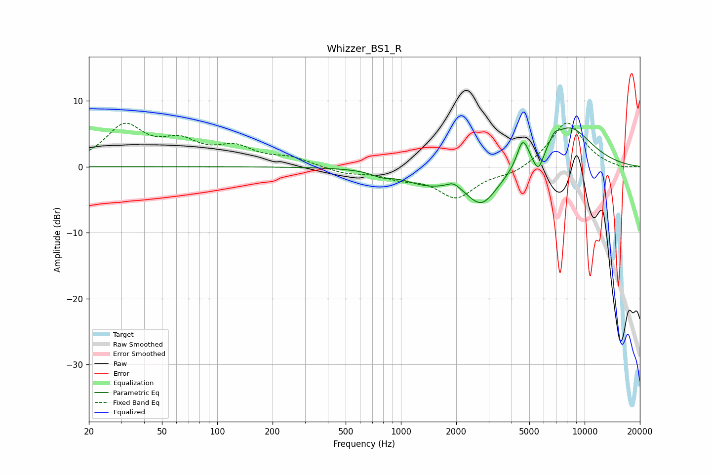

# Whizzer_BS1_R
See [usage instructions](https://github.com/jaakkopasanen/AutoEq#usage) for more options and info.

### Parametric EQs
Apply preamp of -6.0 dB when using parametric equalizer.

|   # | Type    |   Fc (Hz) |    Q |   Gain (dB) |
|-----|---------|-----------|------|-------------|
|   1 | Peaking |       784 | 2.63 |        -0.7 |
|   2 | Peaking |      1388 | 1.05 |        -2.2 |
|   3 | Peaking |      1935 | 4.25 |         0.9 |
|   4 | Peaking |      2806 | 1.59 |        -6   |
|   5 | Peaking |      3024 | 3.23 |         0.5 |
|   6 | Peaking |      4565 | 4.92 |         3.3 |
|   7 | Peaking |      4807 | 6    |         0.7 |
|   8 | Peaking |      5606 | 4.72 |        -3.2 |
|   9 | Peaking |      6845 | 6    |         1   |
|  10 | Peaking |      8173 | 1    |         6.2 |

### Fixed Band EQs
When using fixed band (also called graphic) equalizer, apply preamp of **-6.7 dB** (if available) and set gains manually with these parameters.

|   # | Type    |   Fc (Hz) |    Q |   Gain (dB) |
|-----|---------|-----------|------|-------------|
|   1 | Peaking |        31 | 1.41 |         5.9 |
|   2 | Peaking |        62 | 1.41 |         3.1 |
|   3 | Peaking |       125 | 1.41 |         2.5 |
|   4 | Peaking |       250 | 1.41 |         1.2 |
|   5 | Peaking |       500 | 1.41 |        -0.9 |
|   6 | Peaking |      1000 | 1.41 |        -1.4 |
|   7 | Peaking |      2000 | 1.41 |        -4.5 |
|   8 | Peaking |      4000 | 1.41 |        -1.1 |
|   9 | Peaking |      8000 | 1.41 |         6.9 |
|  10 | Peaking |     16000 | 1.41 |        -0.3 |

### Graphs

