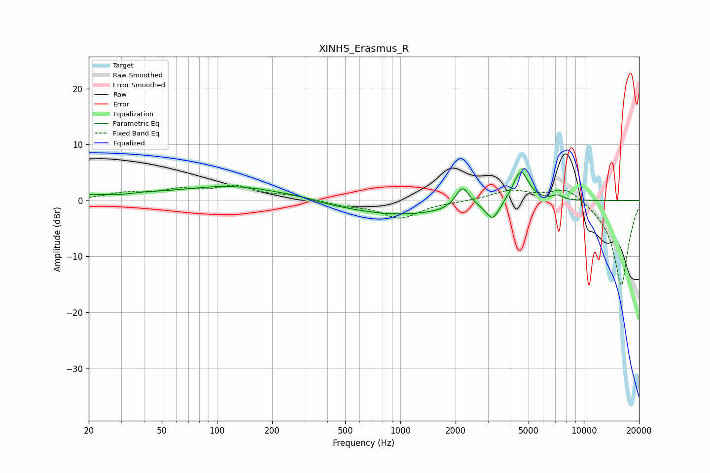

# XINHS_Erasmus_R
See [usage instructions](https://github.com/jaakkopasanen/AutoEq#usage) for more options and info.

### Parametric EQs
Apply preamp of -5.1 dB when using parametric equalizer.

|   # | Type    |   Fc (Hz) |    Q |   Gain (dB) |
|-----|---------|-----------|------|-------------|
|   1 | Peaking |        21 | 1.86 |         0.7 |
|   2 | Peaking |        40 | 1.67 |         0.4 |
|   3 | Peaking |       123 | 0.44 |         2.7 |
|   4 | Peaking |       282 | 1.78 |         0.5 |
|   5 | Peaking |       296 | 1.23 |        -0.4 |
|   6 | Peaking |       982 | 0.42 |        -2.7 |
|   7 | Peaking |      2181 | 3.8  |         3.8 |
|   8 | Peaking |      3191 | 3.93 |        -3.2 |
|   9 | Peaking |      4534 | 3.31 |         5.8 |
|  10 | Peaking |      7196 | 4.81 |         0.8 |

### Fixed Band EQs
When using fixed band (also called graphic) equalizer, apply preamp of **-2.8 dB** (if available) and set gains manually with these parameters.

|   # | Type    |   Fc (Hz) |    Q |   Gain (dB) |
|-----|---------|-----------|------|-------------|
|   1 | Peaking |        31 | 1.41 |         1.2 |
|   2 | Peaking |        62 | 1.41 |         1.6 |
|   3 | Peaking |       125 | 1.41 |         2.3 |
|   4 | Peaking |       250 | 1.41 |         0.8 |
|   5 | Peaking |       500 | 1.41 |        -0.7 |
|   6 | Peaking |      1000 | 1.41 |        -3.1 |
|   7 | Peaking |      2000 | 1.41 |        -0.1 |
|   8 | Peaking |      4000 | 1.41 |         1.8 |
|   9 | Peaking |      8000 | 1.41 |         2.6 |
|  10 | Peaking |     16000 | 1.41 |       -15.4 |

### Graphs

