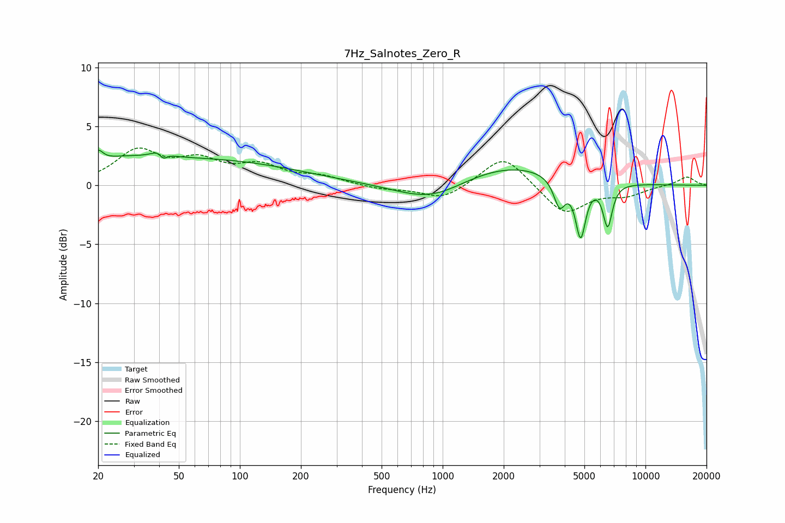

# 7Hz_Salnotes_Zero_R
See [usage instructions](https://github.com/jaakkopasanen/AutoEq#usage) for more options and info.

### Parametric EQs
Apply preamp of -3.1 dB when using parametric equalizer.

|   # | Type    |   Fc (Hz) |    Q |   Gain (dB) |
|-----|---------|-----------|------|-------------|
|   1 | Peaking |        20 | 5.97 |         1   |
|   2 | Peaking |        25 | 1.02 |         0.8 |
|   3 | Peaking |        41 | 4.66 |         2   |
|   4 | Peaking |        42 | 5.86 |        -2   |
|   5 | Peaking |        63 | 0.29 |         2.1 |
|   6 | Peaking |       885 | 0.82 |        -1.7 |
|   7 | Peaking |      2055 | 0.54 |         1.9 |
|   8 | Peaking |      3770 | 4.87 |        -2.4 |
|   9 | Peaking |      4790 | 5.58 |        -4.7 |
|  10 | Peaking |      6512 | 6    |        -3.6 |

### Fixed Band EQs
When using fixed band (also called graphic) equalizer, apply preamp of **-3.3 dB** (if available) and set gains manually with these parameters.

|   # | Type    |   Fc (Hz) |    Q |   Gain (dB) |
|-----|---------|-----------|------|-------------|
|   1 | Peaking |        31 | 1.41 |         2.8 |
|   2 | Peaking |        62 | 1.41 |         1.8 |
|   3 | Peaking |       125 | 1.41 |         1.5 |
|   4 | Peaking |       250 | 1.41 |         0.7 |
|   5 | Peaking |       500 | 1.41 |        -0.3 |
|   6 | Peaking |      1000 | 1.41 |        -1.2 |
|   7 | Peaking |      2000 | 1.41 |         2.7 |
|   8 | Peaking |      4000 | 1.41 |        -2.5 |
|   9 | Peaking |      8000 | 1.41 |        -0.8 |
|  10 | Peaking |     16000 | 1.41 |         0.7 |

### Graphs

