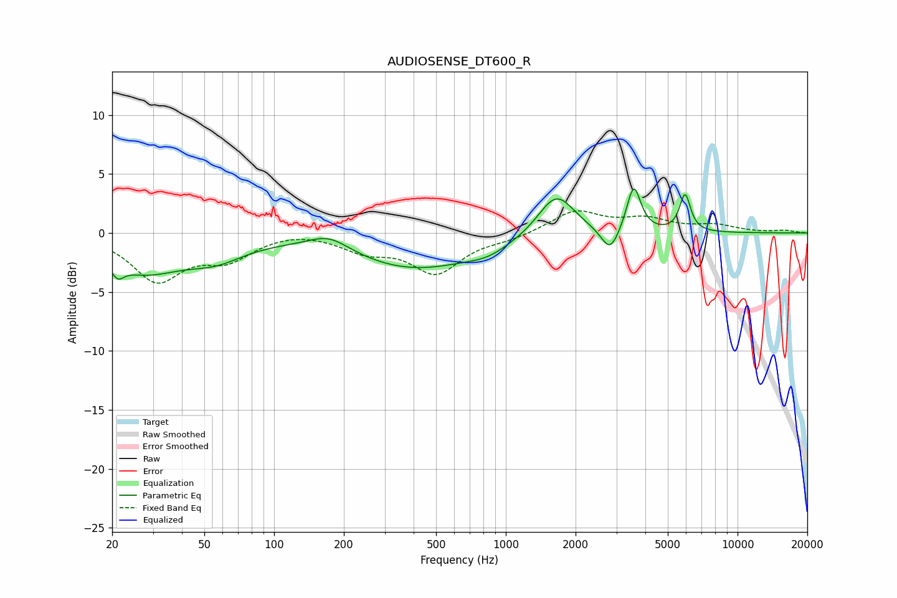

# AUDIOSENSE_DT600_R
See [usage instructions](https://github.com/jaakkopasanen/AutoEq#usage) for more options and info.

### Parametric EQs
Apply preamp of -3.8 dB when using parametric equalizer.

|   # | Type    |   Fc (Hz) |    Q |   Gain (dB) |
|-----|---------|-----------|------|-------------|
|   1 | Peaking |        21 | 5.22 |        -1.2 |
|   2 | Peaking |        27 | 0.86 |        -3   |
|   3 | Peaking |        56 | 1.1  |        -1.6 |
|   4 | Peaking |       173 | 1.58 |         1.3 |
|   5 | Peaking |       405 | 0.5  |        -3   |
|   6 | Peaking |       839 | 1.66 |        -0.6 |
|   7 | Peaking |      1650 | 1.78 |         3.7 |
|   8 | Peaking |      2819 | 3.71 |        -2.1 |
|   9 | Peaking |      3565 | 4.73 |         4   |
|  10 | Peaking |      5936 | 6    |         3.2 |

### Fixed Band EQs
When using fixed band (also called graphic) equalizer, apply preamp of **-2.0 dB** (if available) and set gains manually with these parameters.

|   # | Type    |   Fc (Hz) |    Q |   Gain (dB) |
|-----|---------|-----------|------|-------------|
|   1 | Peaking |        31 | 1.41 |        -3.9 |
|   2 | Peaking |        62 | 1.41 |        -2   |
|   3 | Peaking |       125 | 1.41 |         0.3 |
|   4 | Peaking |       250 | 1.41 |        -1.3 |
|   5 | Peaking |       500 | 1.41 |        -3.3 |
|   6 | Peaking |      1000 | 1.41 |        -0.4 |
|   7 | Peaking |      2000 | 1.41 |         1.9 |
|   8 | Peaking |      4000 | 1.41 |         1.1 |
|   9 | Peaking |      8000 | 1.41 |         0.6 |
|  10 | Peaking |     16000 | 1.41 |         0.2 |

### Graphs

