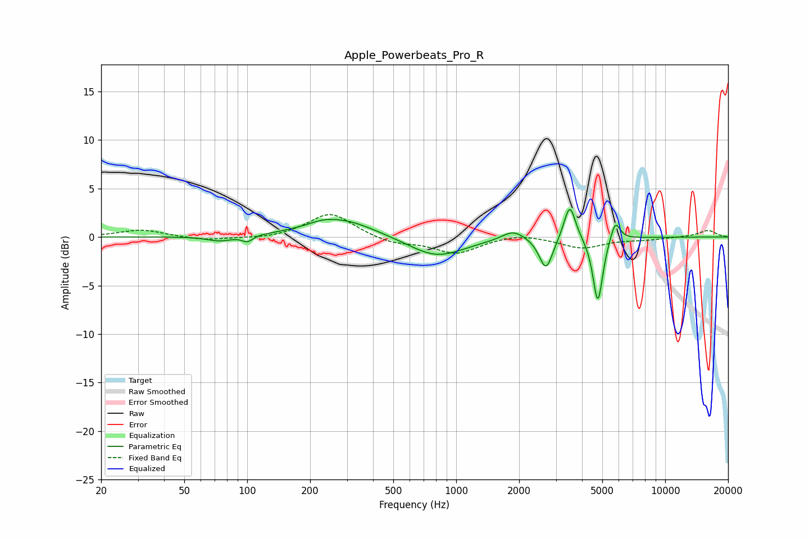

# Apple_Powerbeats_Pro_R
See [usage instructions](https://github.com/jaakkopasanen/AutoEq#usage) for more options and info.

### Parametric EQs
Apply preamp of -2.9 dB when using parametric equalizer.

|   # | Type    |   Fc (Hz) |    Q |   Gain (dB) |
|-----|---------|-----------|------|-------------|
|   1 | Peaking |        74 | 2.35 |        -0.5 |
|   2 | Peaking |       100 | 5.66 |        -0.6 |
|   3 | Peaking |       227 | 2.42 |         0.3 |
|   4 | Peaking |       281 | 0.89 |         1.9 |
|   5 | Peaking |       804 | 1.05 |        -2.1 |
|   6 | Peaking |      1875 | 2.59 |         1   |
|   7 | Peaking |      2689 | 4.46 |        -3.4 |
|   8 | Peaking |      3495 | 5.11 |         3.8 |
|   9 | Peaking |      4762 | 6    |        -6.9 |
|  10 | Peaking |      5766 | 5.98 |         2.1 |

### Fixed Band EQs
When using fixed band (also called graphic) equalizer, apply preamp of **-2.4 dB** (if available) and set gains manually with these parameters.

|   # | Type    |   Fc (Hz) |    Q |   Gain (dB) |
|-----|---------|-----------|------|-------------|
|   1 | Peaking |        31 | 1.41 |         0.8 |
|   2 | Peaking |        62 | 1.41 |        -0.4 |
|   3 | Peaking |       125 | 1.41 |        -0.2 |
|   4 | Peaking |       250 | 1.41 |         2.5 |
|   5 | Peaking |       500 | 1.41 |        -0.7 |
|   6 | Peaking |      1000 | 1.41 |        -1.7 |
|   7 | Peaking |      2000 | 1.41 |         0.4 |
|   8 | Peaking |      4000 | 1.41 |        -1.1 |
|   9 | Peaking |      8000 | 1.41 |        -0.2 |
|  10 | Peaking |     16000 | 1.41 |         0.7 |

### Graphs

